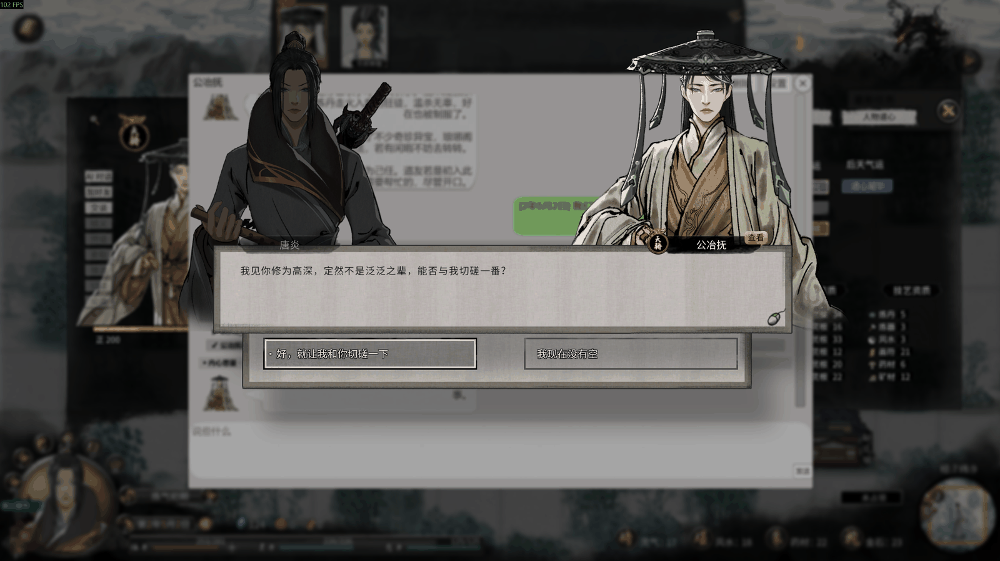
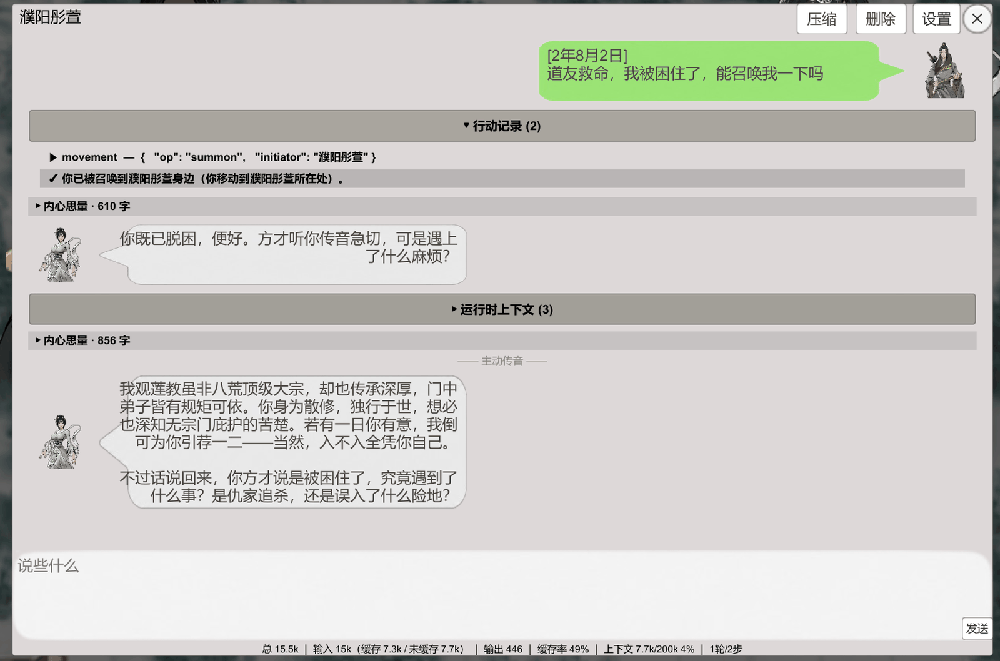
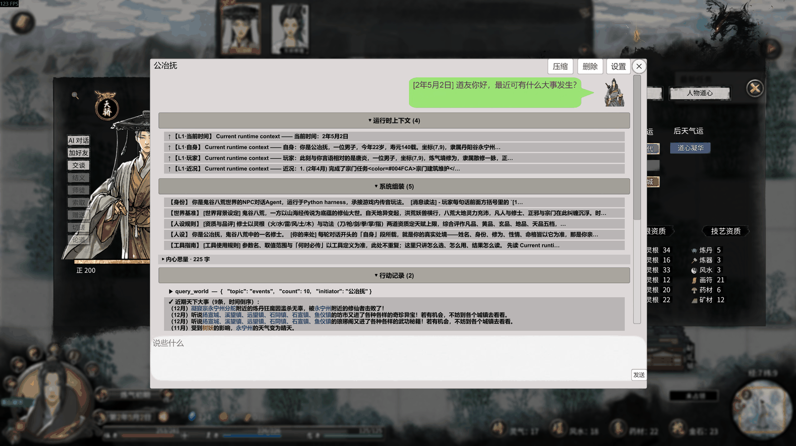
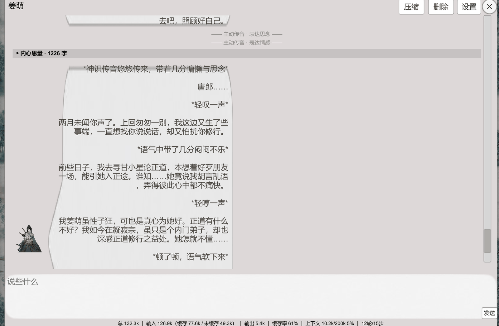
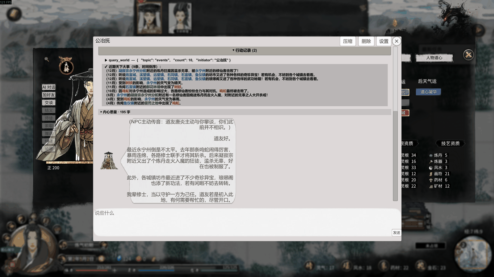
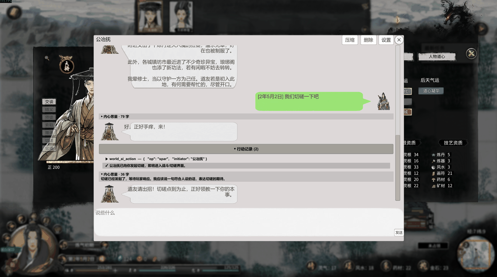
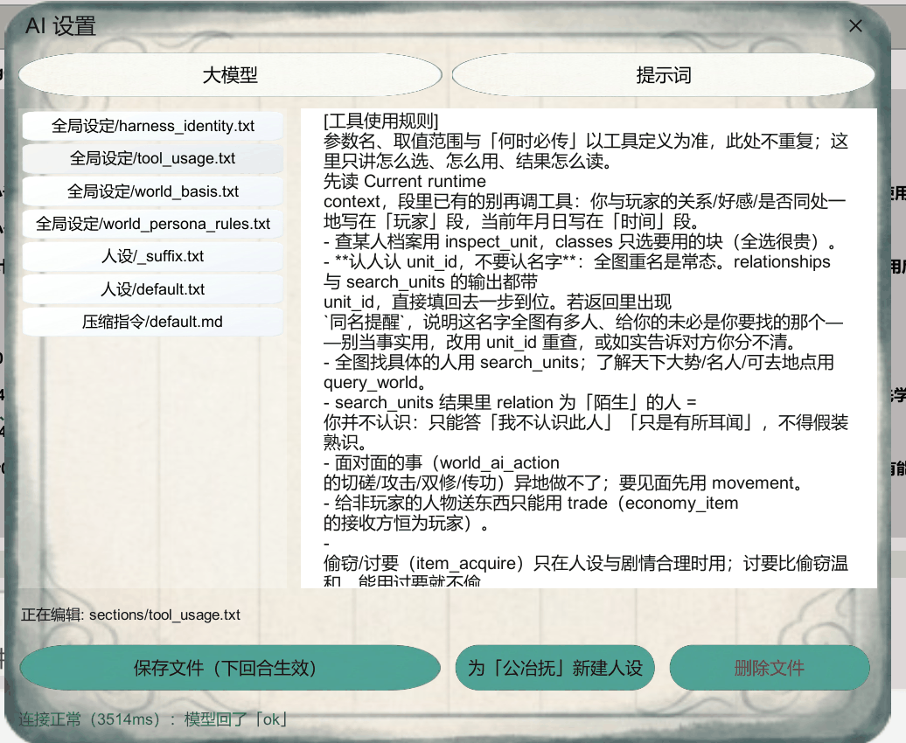
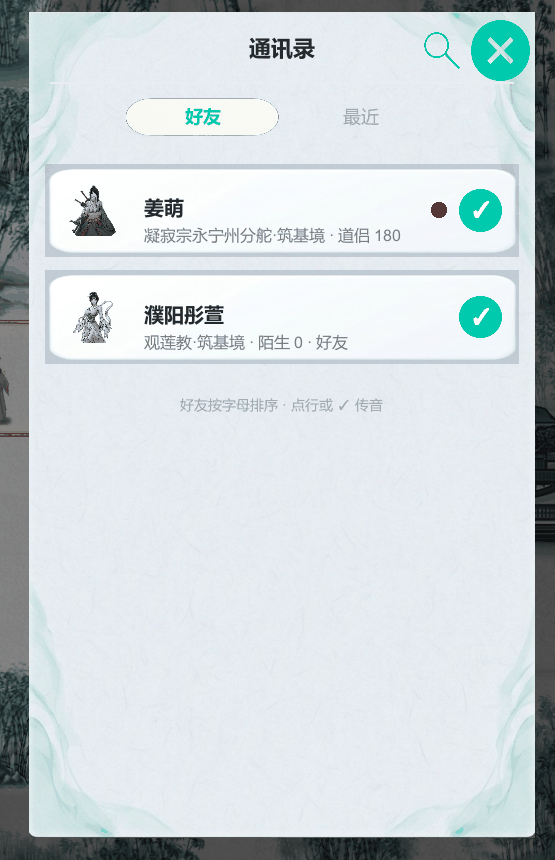
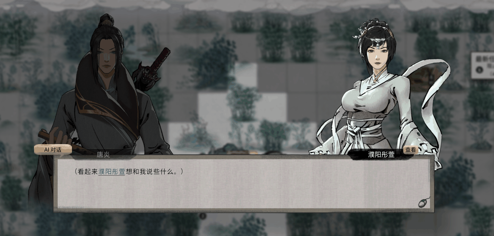
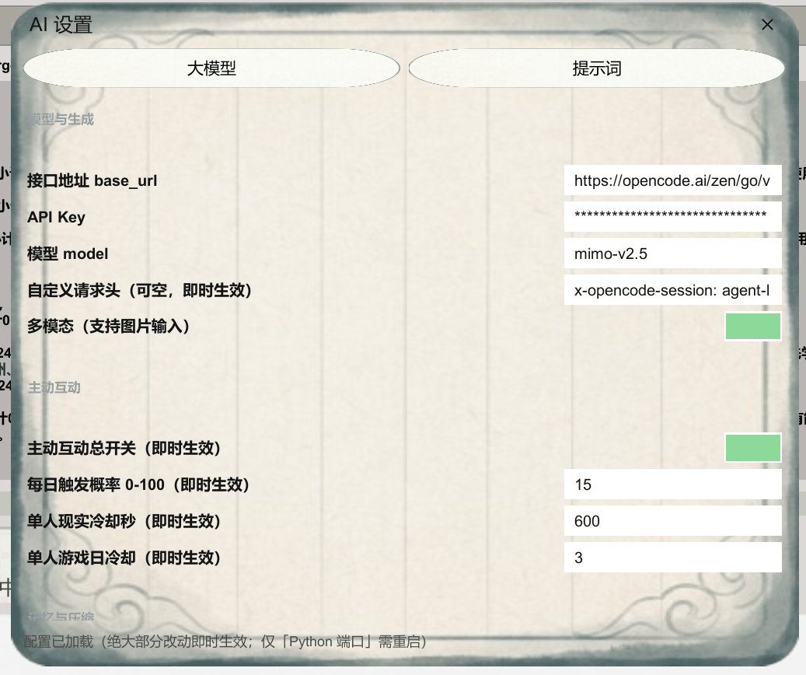

# 八荒智能体

> **由 AI 智能体驱动** —— 感知世界 · 按需调用工具 · 长期记忆 · 自主交互 · 全程可见


让八荒里的每一个人，都有自己的脑子。

**《八荒智能体》** 是《鬼谷八荒》的一个 NPC 对话 Mod。它不是给 NPC 换一套更好的台词库，而是给每一个 NPC 装上一个**真正会思考的智能体**——他看得见你所处的局势，记得住你们之间发生过的事，有自己的脾气和立场，而且**能动手**。

这不是"你输入一句、他回你一段"的聊天框。他是一个**先看、再想、然后真的去做**，最后才开口的人。

---

## ⚠️ 授权与声明（**先读这段**）

**本作品完全免费。** 创意工坊页面：[《八荒智能体》](https://steamcommunity.com/sharedfiles/filedetails/?id=3801664332)

| | |
|---|---|
| ✅ **允许** | 个人学习、研究、阅读源码、自己修改、在自己电脑上随便折腾 |
| ❌ **禁止** | **任何形式的商业用途** —— 包括但不限于**收费群、付费下载、打包进付费整合包、挂在收费网站上、以任何名义向他人收取费用** |
| ❌ **禁止** | **二次打包发布** —— 改个名字 / 换个封面重新上传到创意工坊或任何平台 |
| ❌ **禁止** | 移除或篡改作者署名、本仓库链接、以及程序内嵌的署名信息 |
| 📌 **要求** | 转载、引用、基于本作品做衍生时，**保留作者署名与本仓库链接** |

完整法律条款见 [`LICENSE`](LICENSE)（[PolyForm Noncommercial 1.0.0](https://polyformproject.org/licenses/noncommercial/1.0.0)）。
因为含非商业限制，本作品属于 **source-available（源码可见）**，而非 OSI 定义的开源软件。

### 💰 如果你是花钱买到这个 mod 的 —— 你被骗了

本 mod 在 Steam 创意工坊**完全免费**。任何向你收费的人**都不是作者**，他们只是把免费的东西搬去卖。
请立刻**申请退款**，并向平台**举报**。你不需要为这个 mod 付任何一分钱。

---

## 目录

- [一、他是什么样的](#一他是什么样的)
- [二、看得见：他感知到什么](#二看得见他感知到什么)
- [三、记得住：上次托付的事，他还记着](#三记得住上次托付的事他还记着)
- [四、会动手：他真的能改变这个世界](#四会动手他真的能改变这个世界)
- [五、全程可见：他想了什么、做了什么](#五全程可见他想了什么做了什么)
- [六、有性格：剑修和商人，不是一个味儿](#六有性格剑修和商人不是一个味儿)
- [七、他会主动找你](#七他会主动找你)
- [八、怎么开始聊](#八怎么开始聊)
- [九、快速上手](#九快速上手)
- [十、常见问题](#十常见问题)
- [十一、已知限制](#十一已知限制)
- [十二、技术架构](#十二技术架构)
- [十三、构建与开发](#十三构建与开发)
- [十四、延伸阅读](#十四延伸阅读)
- [十五、反馈](#十五反馈)

---

## 一、他是什么样的



他会在你寿元将尽时劝你早做打算，会在你名动天下之后重新掂量跟你的交情，会在你落难时伸手拉你一把，也会在你身上有利可图时动别的心思。

### 他能感知这个世界

每一次开口之前，他都会先看一眼眼前的一切：你是谁、你在哪、你过得怎么样、你们是什么关系、现在是哪年哪月。这部分是他**直接就能看到的**——不需要额外去打探，张口就知道。

但要真正了解一个人、一件事，光靠"看一眼"是不够的。所以他还有**一整套工具**，可以主动去查。

### 他按需调用工具，而不是把整个世界塞进脑子里

这是一个关键的设计选择。

如果把全图的人物、所有宗门、每个人的档案、每一段历史一开始就全部塞进提示词里，会有三个后果：**慢**（每次请求都要传一大堆东西）、**贵**（按字数计费）、而且**反而更笨**——绝大部分内容和眼前这句话毫无关系，只会淹没真正重要的信息。

所以这里的做法是**按需获取**：

- 你和他是什么关系、好感多少、在不在一处、现在是哪年哪月——这些**每回合都已经在他的感知里**
- 需要更细的信息时，他才去查。**查谁、查到什么程度，由他自己判断**——只要基础身份，还是要翻储物袋和一生经历？查一个人和查一个人的全部家底，代价差很多，他自己会掂量
- 查询是**静默完成**的：不弹窗、不需要你确认、不占用你的操作

### 他会多轮决策，反复反馈

一个回合，他通常不是"看到一句话 → 吐一句话"。真实过程更接近人：

```
感知局势 → 判断要不要查 → 调用工具 → 读结果
    → 发现还得再查 → 再调 → 想清楚 → 动手 / 开口
```

这一整套可以在一个回合里连续跑好几轮。所以你问他"隔壁那个宗门最近怎么样"，他可能先去查了天下大事，发现那个宗门被人占了，又去翻了宗门名录，最后才回你一句带着具体信息的话——而不是含糊地说"我也不太清楚"。

下面这张图里，你请求他把你召唤过去。他先调用工具完成了召唤，然后**又想了想**该说什么，最后才回话。底部状态栏写着「**1轮/2步**」——一个回合，两步决策：



### 对话是追加式的，所以能吃到缓存

对话记录是一条**只往后追加的账本**——已经写下的内容不会回头改动，新的内容永远加在末尾。

这一点看着朴素，但很值钱：因为每次请求的**开头部分**（他的系统提示词、人设、规则、早期历史）和上一次几乎完全一样，模型服务商的**前缀缓存**就能命中。命中的部分按缓存价计费——通常比正常价格便宜很多，而且**首 token 来得更快**。

跟他处得越熟，前面那一大段固定的内容就越不需要重复付费、重复计算。

只有一个必要的例外：**整理记忆的时候**。历史太长装不下时，久远的对话会被压成摘要——这一次会改动视图。但这是偶尔发生的一次性动作，不是每句话都在改。

### 还有

| | 他做到的事 | 你会感觉到 |
|---|---|---|
| **看得见** | 每回合先感知局势 | 他不会在你刚被追杀完时跟你聊天气 |
| **记得住** | 长期记忆 + 自动整理 | 上次托付的事，他还记着 |
| **会动手** | 九个工具，能真改世界 | 他真的会拜你为师、送你东西、约你论道 |
| **有性格** | 每个 NPC 独立人设 | 剑修和商人说话不是一个味儿 |

而最特别的一点是：**他思考与行动的全过程，你都能看见。**

---

## 二、看得见：他感知到什么

**他眼里的你：**

- 姓名、性别
- 你所在的**境界**、你的**宗门**——没宗门，他会说你是「散修」
- 你们**隔多远**：站在同一格，就是面对面说话；不在一格，就是隔着山水以传音相谈
- 你们**是什么关系**：道侣、师徒、结义兄弟、仇人……
- 他对你的**好感**（分五档，每档措辞完全不同）
- 你的**容貌**、**声名**、**心境**

**他眼里的自己：**

- 姓名、性别、**年龄**、**还剩多少寿元**
- **道号**、宗门、境界、种族
- 容貌、声名、心境、**战力**、体魄、**悟性**
- **爱好**（最多 5 个）
- **内外性格**，以及性格注解
- **先天气运**与**后天气运**
- 他**最近经历的事**（最近 6 条）

以及**当前的游戏内时间**——他知道现在是哪年哪月哪日。

这意味着什么呢？意味着一个活了三百年的元婴老怪，会知道自己寿元将尽；意味着你在雷泽混得风生水起的时候，永宁州的老朋友会听说了你的名声；意味着他记得**上一次见你是几个月前**——每句对话都带着日期戳，他能自己算出时间流逝。

而且这些东西**不是黑箱**。下面这张图里，「运行时上下文」折叠区把注入给他的每一条都列了出来——他自己的身份、他眼里的你、当前时间、他的近况，一条不落：



---

## 三、记得住：上次托付的事，他还记着

你们说过的每一句话，都会写进他自己的账本。

今天告诉他的一件事，过几天回来他还记得。托付过的事，下次见面他会主动提起。哪怕你关掉游戏重开，只要**存过档**，记忆就在。

聊得久了，历史会越来越长，装不进模型能读的窗口。这时候他会**自己整理记忆**——把久远的对话压成摘要，最近的部分原样保留。这个"保留多少原文"和"什么时候开始整理"，都在设置里可以自己调。

如果你觉得某段对话不该留着（比如读档后想重来一次），对话窗标题栏有个删除模式，可以像微信一样多选，整段整段地删掉。

下面这段是他主动发来的。他记得你们**两个月没说过话**，记得上一次见面很匆忙，也记得自己前不久跟谁闹了别扭——这些都不是当前这一刻能"看到"的，是**记忆**：



---

## 四、会动手：他真的能改变这个世界

大多数 AI 对话到"说"就结束了。而这里，NPC 手上有**九个工具**——他能查、能看、能想，然后**真的去做**。做完之后，游戏里的世界是真的变了。

### 他先查清楚，再开口

三个只读工具，让他有"眼睛"：

- **查人**：任何一个人的档案他都能翻——境界、宗门、位置、关系、好感、气运、全部属性、功法、储物袋、关系网、以及**一生的经历**（能按年份翻）。他不会被你问倒"某某是谁"。
- **找人和了解天下**：他可以在整个八荒范围内搜索特定的人，也可以随时了解天下大势——近期发生了什么大事、谁的战力排第几、哪些城镇宗门可以去。

这一点带来的差别很直接：**他不会瞎编。**

八荒里同名的人多如牛毛，他认人认的是内部编号而不是名字。如果他查到一个名字下面有好几个人，他会**如实告诉你"我分不清你说的是哪个"**，而不是随便挑一个装作认识。同样，如果查出来你问的人他根本不认识，他会说"我不认识此人"，而不是硬编一段交情。

下面这张是他查完天下大事之后的回答。注意他说的每一条——鸣蛇闹事、炼丹狂徒、坊市新到的奇珍异宝——**全都能在上面的「行动记录」里找到出处**：



### 然后，他会真的去做

六个动作工具，每一个都会**真实地改变游戏世界**：

**关系** —— 他会对你动心。好感可以增减，也可以**结为道侣、拜你为师、收你为徒、与你结义、认作义父母**，当然也可以**断绝关系、解除婚约**。这些不是台词，是游戏里真实的关系变更。

**位移** —— 他会主动来找你。可以把你**召唤**到他身边，可以**传送到你所在之处**，也可以**动身前往某个城镇宗门，在那里等你**。异地做不了的事（切磋、双修、传功），他会先想办法见上面。

**行动** —— 他会对你发起行动：**切磋、攻击、双修、论道、邀约、传功**。攻击是真的进入战斗，打完由游戏自己结算结果；传功是真的把功法传给你。

**赠予** —— 他会送你东西。灵石、丹药、装备，可以混着送。异地也能送，附一封信也可以。东西不够的时候，他把有的全给你。

**买卖** —— 他会在你和他之间牵线做交易，买方卖方都可以是别人。谈不拢的价，你点「成交」才算数。

**索取** —— 他也会**偷你的东西**，或者开口向你要。前者被发现会掉好感；后者温和些——所以在人设和剧情合理的时候，他更倾向于开口讨要，而不是动手偷。

### 他不会乱来

能改变世界，就意味着必须有限制。这里在三个层面上拦着：

**他自己知道分寸。** 能不能做，规则写在他脑子里——面对面的事异地不做，关系还没到位不越界，偷窃只在人设和剧情合理时才用。这些不是事后补救，是他**在决定之前**就遵守的。

**服务端会复核。** 所有的关系变更、行动、交易，都要经过一层独立校验：好感够不够、关系冲不冲突、人在不在同一格、战力是否合理、货物灵石是否足额。不通过就直接拒绝，并把原因告诉他。

**最后一定要你点头。** 关系变更、赠送、交易、双修、传功这些真正影响你的动作，都会弹出确认窗——**你点同意，才会发生**；你点拒绝，这事就没发生。而且他得在确认窗里写一句**第一人称的台词**：求婚词、结义词、拜师词，都是他根据当时的情境和你们的过往**自己写的**，不是预置文案。

还有一层体贴的设计：**你正忙着的时候，他不会来打扰你。** 战斗中、开着别的界面、有剧情弹窗的时候，他只能用言语和只读工具，所有会改变世界的动作都会被拦下。

---

## 五、全程可见：他想了什么、做了什么

这一节值得单独讲，因为它是这个 mod 最特别的地方。

在对话框里，NPC 说的那句话只是**最终结果**。而那句话是怎么来的——他先想了什么、去查了什么、查到了什么、为什么这么答——**你全都能看见**。

聊天窗里一共有四个通道：

**内心思量 —— 他想了什么**

模型在给出回答之前的推理过程，会**实时地、一个字一个字地**出现在对话流里，标题栏的字数还在往上跳。你能看到他犹豫、推翻、重新考虑。支持思维链的模型会完整展示这一段，不支持的模型则不会出现这一块。

**行动记录 —— 他做了什么**

每一次工具调用都会留下一行：**调用了哪个工具、传了什么参数（完整原文）、拿回来什么结果**。执行的时候自动展开，做完自动收起，想细看随时点开。

**系统组装 —— 他这次看到的人设和规则**

他的提示词是由哪些段落拼起来的，每一段的内容是什么，全部列出来。

**运行时上下文 —— 这一次的感知数据**

显示这一回合的局势信息。只列**发生变化的部分**（比如这次多了一条"你们不在一处"），没变的不重复刷屏；某段不适用了会标成「（已移除）」。

> 思考和行动记录会跟着对话一起保留，往上翻很久以前的记录，当时的完整过程都还在。
> 系统组装和运行时上下文是**当下实时**显示的，不参与历史回放。

看下面这一屏——这是他提议切磋的**完整经过**：

1. 「内心思量 · 79 字」——他在想该怎么回应你
2. 「行动记录」展开 → `world_ai_action`（op=spar）→ 返回「已向你发起切磋」
3. 「内心思量 · 36 字」——「切磋已经发起了，等待玩家响应。我应该说一句符合人设的话，表达切磋的期待。」
4. 最后才是他的台词：「道友请出招！切磋点到为止，正好领教一下你的本事。」

**从"想"到"做"再到"说"，中间一步都没藏。**



**这件事有两个用处。**

一是**好看**。看着一个人在你面前思考、犹豫、跑出去打听消息、再回来跟你说话——这本身就有意思，比盯着一个空白的气泡等它蹦字强得多。

二是**好用**。哪天他答得不对劲，你翻一眼就知道问题出在哪：是人设没写好？是局势数据没给到？还是模型自己想歪了？设置面板里还有个「提示词」页签，改完下一句就生效，当场就能验证。

---

## 六、有性格：剑修和商人，不是一个味儿

每个 NPC 都有自己的人设文件。你可以给**每一个人单独写性格**，也可以写一份通用的兜底人设，所有没单独设置的 NPC 都用它。此外还有一份「附加规则」，会拼在每个人设后面，用来写一些普适的说话规矩。

游戏里按 **F11** →「提示词」页签就能直接改：左边选文件，右边编辑，保存。**下一句话就生效，不用重启游戏。** 还有个「新建人设」按钮，点一下就用当前正在对话的 NPC 名字建一份新的。

可改的不只是人设——提示词里的**每一段**都摆在明面上：身份、世界设定、人设规则、人设本身、工具使用指南、压缩指令，想动哪段就动哪段。



---

## 七、他会主动找你

不用你去找他。每天有一定概率，某个跟你有交情的 NPC 会主动传讯过来——屏幕上会先弹一条横幅，点开就是他的消息。

触发概率、冷却时间都可以自己调，也可以整个关掉。好感低的人找你找得少（概率减半），刚找过你的会冷却几天。


主动发来的消息会标注理由（「表达思念」「表达情感」之类），方便你一眼看出他为什么突然想起你。

**找人也很方便。** 按 **F10** 打开通讯录，有交情的 NPC 都在里面，按名字排序，显示宗门、境界、和你的关系与好感。谁有新消息会亮红点：



---

## 八、怎么开始聊

有三个入口，随你顺手：

- **在游戏里遇到 NPC**，对话时点一侧的「**AI 对话**」按钮——当前这场对话的背景会直接带过去
- **按 F9**，直接开对话窗
- **按 F10** 打开通讯录，点某一行



---

## 九、快速上手

### 第一步：给它一个大脑

这个 mod 本身不含 AI。你可以理解成：**mod 是身体，大模型是脑子，你得自己给它接一个脑子。**

你需要准备三样东西：**接口地址**、**API Key**、**模型名**。三条路，任选一条：

| 方案 | 适合谁 | 花费 |
|---|---|---|
| 用大模型厂商的官方 API | 想省事 | 按量付费，日常聊天很便宜 |
| 用聚合 / 中转服务 | 想一个 key 用多个模型 | 同上 |
| 本地跑模型（Ollama 等） | 有显卡、在意隐私 | 免费，但要自己折腾 |

> 建议选一个**支持工具调用**的模型——九个工具是这里一半的乐趣所在，而工具调用需要模型支持。
> 另外，**支持思维链的模型**还能让你在「内心思量」里看到他的思考过程。

### 第二步：填进游戏里

按 **F11** 打开 AI 设置 →「大模型」页 →【模型与生成】→ 填入接口地址、API Key、模型名 → 点「**测试连接**」。



这个按钮会**当场告诉你通没通**。通了会在底部显示绿色的一行，比如「连接正常（3514ms）：模型回了「ok」」。

没通的话，它会告诉你**到底是哪一步错了**——是地址写错了、key 不对，还是这个网关要求额外的请求头。有些网关必须带自定义请求头才能用，测试连接会直接告诉你该往「自定义请求头」那一行填什么。

改完点「保存大模型设置」。**绝大部分设置即时生效**，只有「Python 端口」这一项需要重启。

### 第三步：找人聊天

按 **F9** 打开对话窗，或者按 **F10** 从通讯录里挑一个，开始。

---

## 十、常见问题

**Q：要花钱吗？**
mod 本身免费。AI 的钱是付给你自己选的模型服务的，不是付给作者。而且因为他用的是追加式对话、能吃到前缀缓存，重复的那部分按缓存价计费，长期聊下来会比"每句话都重发全部上下文"便宜不少。

**Q：会不会卡？**
不会。AI 的计算在游戏之外单独进行，不占用游戏主线程。查询类的工具调用是静默完成的，不打断你。你正忙的时候他也不会来打扰你。

**Q：支持哪些模型？**
任何 **OpenAI 兼容**的接口都可以。但要体验到完整功能，建议用支持工具调用的模型。

**Q：他说的话记不住？**
先看这两个原因：
1. **你没有存档就退出了。** 记忆跟着存档走。
2. **你没填 API Key。** 没配大脑的时候，NPC 只会复读你说的话。

**Q：我的存档安全吗？**
mod **只读**游戏数据，不写游戏存档。对话记录存在你自己电脑上，除了你自己填的那个模型服务，不会发给任何人。

**Q：他会不会乱改我的关系、乱拿我的东西？**
不会。所有影响你的动作都要经过服务端校验，并且**必须你在确认窗里点同意**才会发生。你点拒绝，这件事就是没发生。

**Q：怎么删掉某个人的记忆？**
对话窗标题栏的删除模式，多选删掉整段对话。或者直接删掉会话存储目录里对应的文件，那个人的记忆就清空了。

**Q：支持英文吗？**
界面目前只有中文。

**Q：他回复太慢 / 一直不回复？**
换个快一点的模型，或者在设置里把上下文窗口调小。大部分延迟来自模型本身。

---

## 十一、已知限制

**1. 记忆跟着存档走 —— 这条最容易误解**

对话和记忆是**跟着你的游戏存档保存**的：你存档，这段对话就刻进去了；你读档，记忆就回到存档那一刻——和游戏里其它东西一样。

所以：**聊完记得存档，不然这次对话等于没发生。**

**2. 必须自备模型接口。** mod 不含 AI，也没有内置额度。

**3. 必须联网。** 除非你在本地跑模型。

**4. 工具调用需要模型支持。** 不支持工具调用的模型，只能聊天，不会做事。

**5.「内心思量」需要模型支持思维链。** 不支持的模型只会跳过这一段，其它功能不受影响。

**6. 界面只有中文。**

**7. AI 回复需要几秒钟。** 取决于模型和网络。本地小模型会更慢。

**8. 上下文窗口要跟模型匹配。** 设置里默认 32K，你的模型窗口更小就调小，否则会被网关拒绝。

**9. 打开本 mod 的界面时，游戏原生快捷键会被屏蔽**（ESC 与鼠标点击不受影响）。

---

## 十二、技术架构

### 双进程：Python 是大脑，C# 是双手

项目由两个进程组成，以**单条 WebSocket 全双工连接**交换 JSON：

```
┌──────────────────────────────┐         ┌───────────────────────────────┐
│  《鬼谷八荒》游戏进程          │         │  独立 Python 进程              │
│                              │         │                               │
│  MOD_Jgmg5L.dll              │   WS    │  AgentLoopServer              │
│  （MelonLoader / IL2CPP）     │◄───────►│  （AgentLoop 框架）            │
│                              │  :8766  │                               │
│  · 读游戏状态、执行动作        │         │  · 对话决策、工具调度          │
│  · Unity 主线程调度           │         │  · 记忆、压缩、提示词装配       │
│  · 三个游戏内面板              │         │  · 调用大模型 API              │
└──────────────────────────────┘         └───────────────────────────────┘
```

**C# 侧（双手）** 只做游戏里的事：读 `g.world` / `g.conf` 的状态、在主线程上执行动作、渲染面板。它不做任何决策。

**Python 侧（大脑）** 只做决策：装配提示词、调用大模型、解析工具调用、管理记忆。它不碰游戏内存。

这样切分的好处是：AI 逻辑的迭代完全在 Python 里，改提示词、改工具定义不需要重新编译 DLL、不需要重启游戏。

### 一个回合发生了什么

```
玩家发言
  │
  ├─ C# 拼上游戏内时间戳，连同感知数据一起发出
  ▼
Python 装配 SystemPrompt（分层拼接）
  │
  ├─ 调用大模型 → 流式返回「内心思量」
  │
  ├─ 模型要求调用工具？
  │     └─ 转发给 C# → 在游戏里执行 → 结果回传 → 继续下一轮决策
  │
  ├─ 模型给出最终台词
  ▼
C# 渲染进对话窗（气泡 / 思维链 / 行动记录）
```

一个回合可以包含多轮工具调用，直到模型认为可以开口为止。

### 核心设计

**事件溯源会话** —— 对话是一条只追加的账本。UI 展示的历史是投影出来的，账本本身从不回改。

**SystemPrompt 分层** —— 提示词由若干独立段落拼成（身份 / 世界设定 / 人设规则 / 人设 / 工具使用 / 时间与近况），每段独立管理、可单独编辑。运行时上下文按段差分注入：只发变化的段，没变的不重复发送。

**按需工具** —— 九个工具分只读（查人 / 搜索 / 天下大势）与动作（关系 / 位移 / 行动 / 赠予 / 买卖 / 索取）两类。工具的参数契约、实际执行、结果渲染三方对齐，有自动化测试钉住。

**动作二次校验** —— 模型给出的动作不直接执行。C# 侧会独立复核好感、关系互斥、同格、战力、物资是否足额，不通过就拒绝并回传原因。

**中文计量压缩** —— 历史超预算时把久远对话压成摘要，保留最近原文。压缩阈值、保留比、上下文窗口都可配置且即时生效。

**存档隔离** —— 记忆按存档（世界 ID）分目录存储，读档即回滚，存档即固化。

### 目录结构

```
agent_loop/
├── agent_loop.py            AgentLoop：管生管毁 + 并发回合调度
├── dialogue_agent.py        单 NPC 对话回合：决策循环 + 工具执行
├── system_prompt.py         提示词分层装配（sections / personas / traits）
├── session.py               事件溯源会话账本
├── history.py               UI 历史投影
├── inbox.py                 消息双筐（待处理 / 已处理）
├── compaction/              中文计量压缩（计量 / 剪枝 / 摘要）
├── llm/                     模型适配层（openai / 流式 / 重试 / 探测）
├── tools/                   工具 schema 与结果渲染
├── prompts/                 提示词素材（人设 / 段落 / 压缩指令）
├── bridge.py                游戏侧抽象（Stub / WS 两种实现）
├── ws_channel.py            WebSocket 服务端与 RPC 分发
└── tests/                   自动化测试

csharp/
├── ModMain.cs               插件入口
├── About.cs                 署名与版本
├── WsClient.cs              WS 客户端（纯托管 RFC6455）
├── MainThreadDispatcher.cs  Unity 主线程调度
├── ToolExecutor.cs          九个工具的动作落地
├── GameContext.cs           运行时上下文装配
├── UnitSnapshot.cs          人物快照（属性 / 经历 / 时间）
├── NpcInitiativeMonitor.cs  NPC 主动开口监测
├── UI/                      三个游戏内面板与剧情窗注入
└── AgentLoopBridge.csproj
```

---

## 十三、构建与开发

### 环境

- **Python 3.13**（`pip install -r requirements.txt`）
- **.NET Framework 4.7.2** 编译环境
- **.NET 8 SDK**（打包自包含 exe 用）

### Python 侧

```bash
pip install -r requirements.txt
python -m pytest tests/ -q          # 跑测试
python scripts/server.py            # 单独启动大脑（调试用）
```

Python 包以 `agent_loop` 为名被导入，因此**仓库目录名需为 `agent_loop`**。

### C# 侧

```bash
dotnet build csharp/AgentLoopBridge.csproj -c Debug
```

编译依赖游戏目录下的程序集。默认从 `E:\SteamLibrary\steamapps\common\鬼谷八荒` 读取，换机器请改 `AgentLoopBridge.csproj` 里的 `GameRoot`，或设环境变量：

```bash
set GGBH_GAME_ROOT=D:\...\鬼谷八荒
```

产物为 `csharp/bin/<配置>/MOD_Jgmg5L.dll`，部署到 `ModExportData/Mod_Jgmg5L/ModCode/dll/`。

发包用 `-c Release`：Release 配置关闭了 PDB 生成，避免把开发机绝对路径写进 DLL 一起发给玩家。

### 目录约定

| 环境变量 | 作用 |
|---|---|
| `GGBH_GAME_ROOT` | 编译期：游戏安装目录（找程序集引用） |
| `AGENT_LOOP_DATA` | 运行期：数据根目录（config.json / prompts / logs 都锚它） |

未下发 `AGENT_LOOP_DATA` 时退回包目录，即开发机与全部单测的现有行为。

---

## 十四、延伸阅读

[`docs/APPENDIX.md`](docs/APPENDIX.md) —— 面向改代码的人的深入附录：

| 节 | 内容 |
|---|---|
| **A** | C#↔Python 桥契约（单 WebSocket 全双工）：帧格式、RPC 清单、超时与重试 |
| **B** | 日志规约与排障手册：「慢 / 卡住 / 没回复 / 进程没了」怎么查 |
| **D** | 开发铁律与高频踩坑（IL2CPP 线程与类型、指人靠 id、经历日志层序等） |
| **E** | UI 工作流：预制件 → AB → 部署 → 验证 |
| **G** | 功能设计底稿：提示词分层、工具结果分工、压缩策略等取舍理由 |
| **H** | 官方 API 与反编速查表 |

---

## 十五、反馈

有问题、有想法、想加新功能，欢迎提 [Issue](https://github.com/iuu-zyh/agent_loop/issues)。

如果这个 mod 让你重新愿意跟八荒里的 NPC 说话，给个好评就是最大的支持。

---

## 许可

[PolyForm Noncommercial 1.0.0](LICENSE) —— 禁止商用，禁止二次打包发布。
