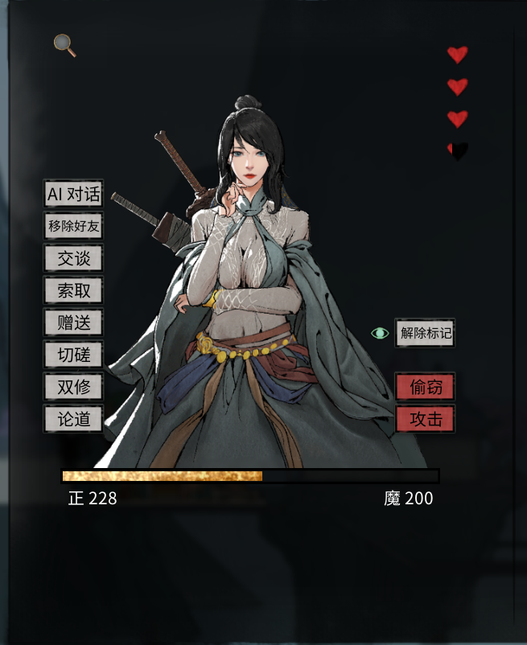
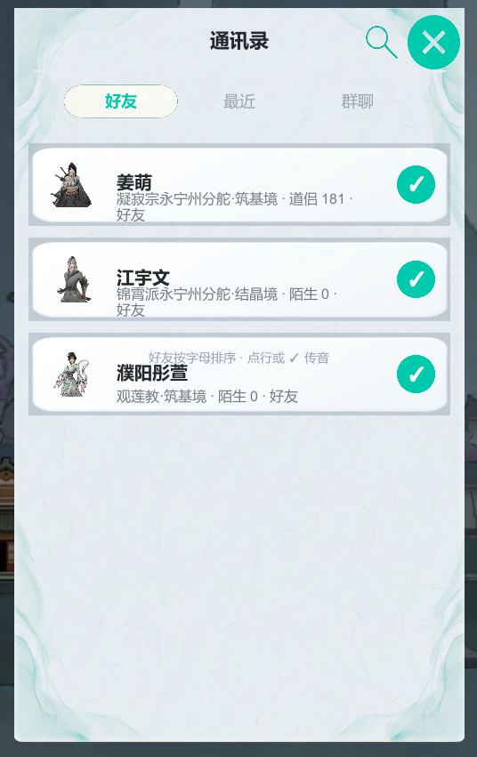
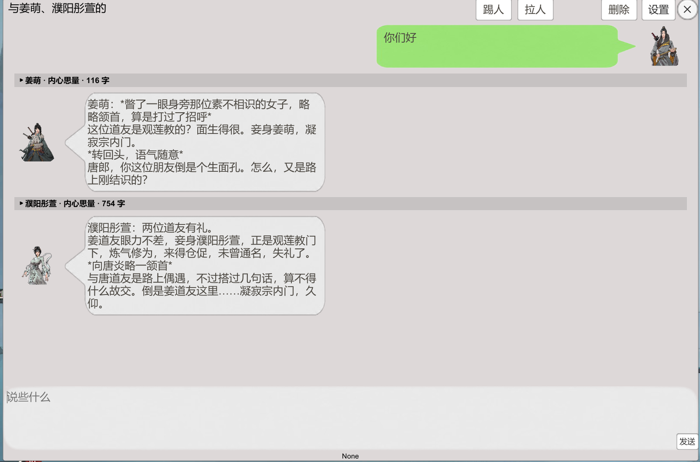
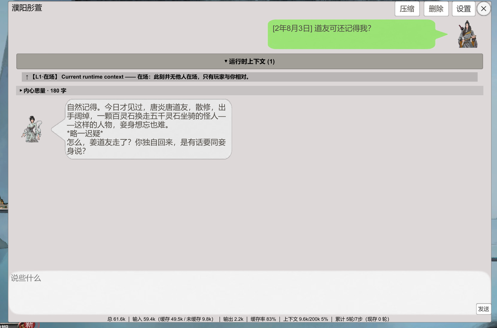
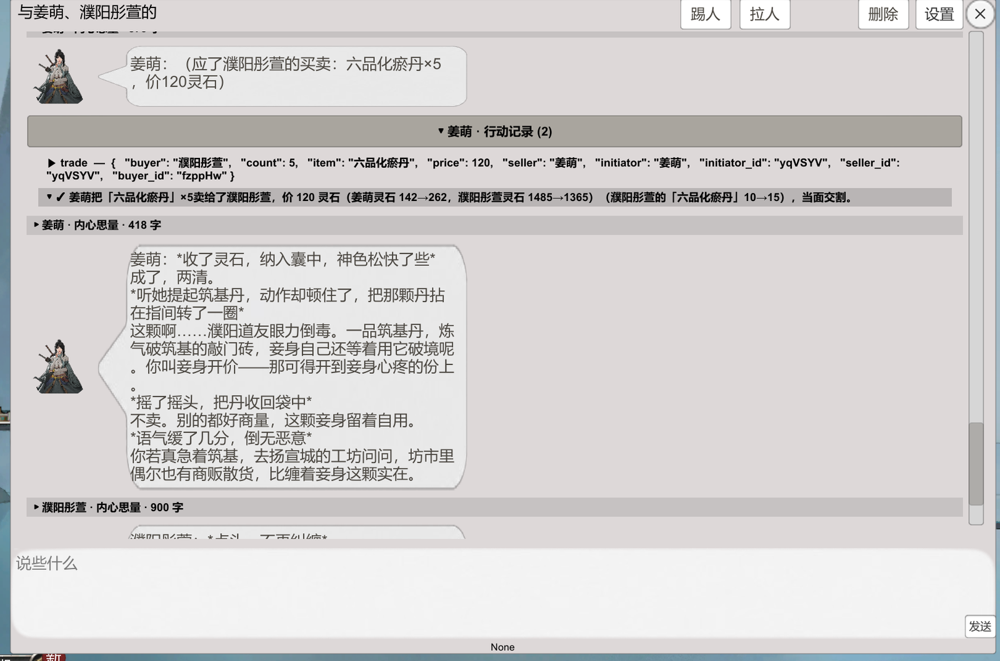
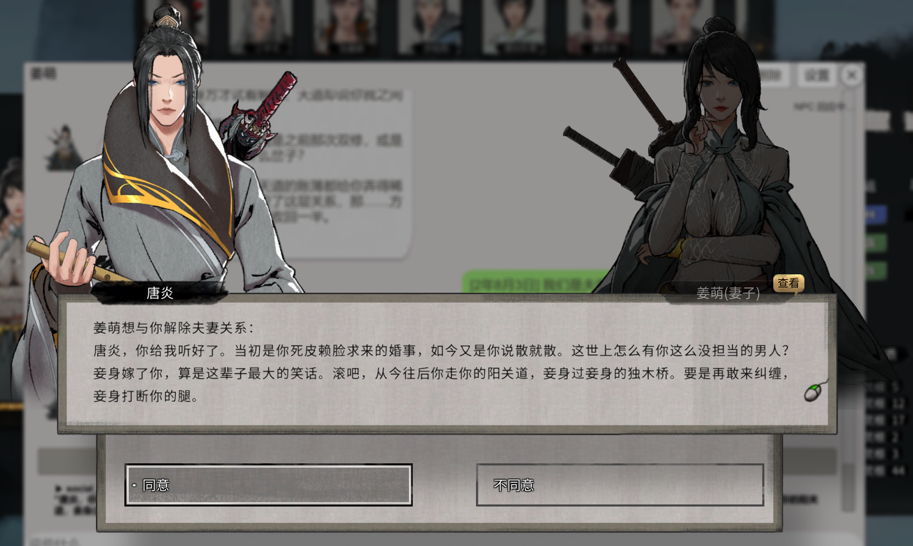
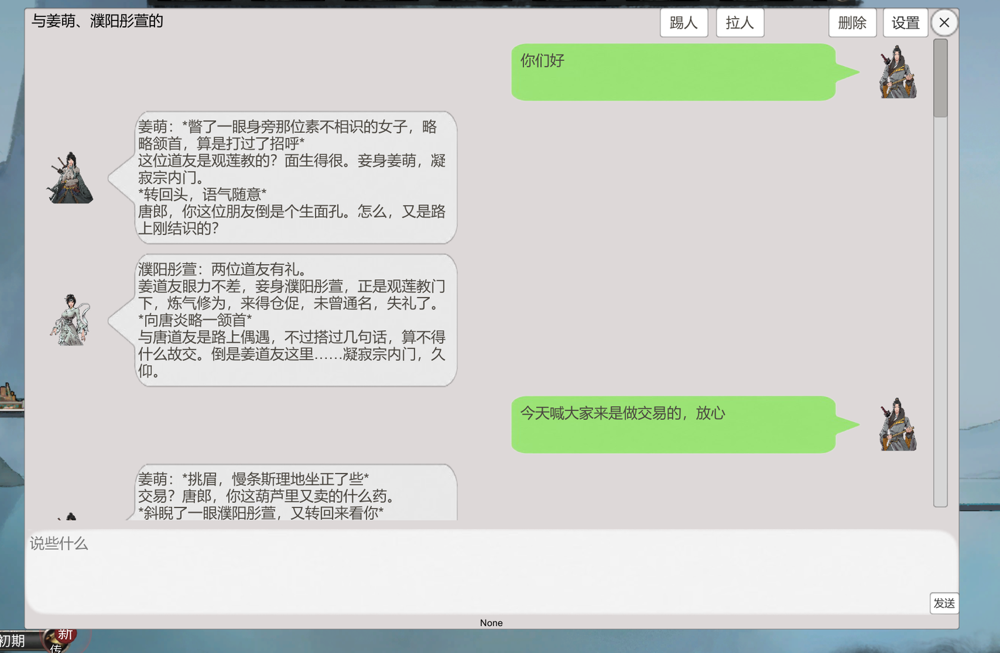

# 八荒智能体

《鬼谷八荒》的 NPC 对话 MOD。它给游戏里的 NPC 接上一个大模型，让他们有自己的记忆和性格，并且能调用工具在游戏里做事。

免费发布在 Steam 创意工坊：[《八荒智能体》](https://steamcommunity.com/sharedfiles/filedetails/?id=3801664332)。任何向你收费的都不是作者，见文末[许可](#许可)。


## 目录

- [一、这是什么](#一这是什么)
- [二、使用教程](#二使用教程)
  - [安装](#安装)
  - [配置大模型（必做）](#配置大模型必做)
  - [开始聊天](#开始聊天)
  - [群聊](#群聊)
  - [改提示词与参数（可选）](#改提示词与参数可选)
  - [存档、记录与卸载](#存档记录与卸载)
  - [出问题了看这里](#出问题了看这里)
- [三、具体介绍](#三具体介绍)
  - [他每回合知道什么](#他每回合知道什么)
  - [记忆](#记忆)
  - [工具](#工具)
  - [过程可见](#过程可见)
  - [性格与提示词](#性格与提示词)
  - [主动交互](#主动交互)
  - [群聊是怎么跑的](#群聊是怎么跑的)
  - [设置项一览](#设置项一览)
  - [常见问题](#常见问题)
  - [已知限制](#已知限制)
  - [技术架构](#技术架构)
  - [构建与开发](#构建与开发)
- [许可](#许可)
- [反馈](#反馈)

---

## 一、这是什么

装上这个 MOD 之后，和 NPC 说话不再是从游戏自带的台词里挑一句，而是由大模型当场生成回复。它和"给 NPC 换一套更好的台词库"的区别在于：回复是现场想出来的，并且会参考下面这些信息。

- **他看得见当下的局势**：你是谁、你们是什么关系、好感多少、在不在同一处、现在是哪年哪月。这些内容每回合自动带上，不需要额外操作。
- **需要更细的信息时，他自己去查**：对方什么境界、身上有什么、最近天下发生了什么事。查谁、查到多细由他自己判断。查询是静默完成的，不弹窗、不打断你。
- **他记得你们之前聊过什么**：同一个 NPC 的单聊和群聊共用一份记忆，记忆跟着游戏存档走。
- **他能动手**：送礼、切磋、传授功法这类会改变游戏状态的操作由他在对话里发起。真正影响你的动作大多会弹出确认窗，**你点同意才会发生**。
- **他会主动找你**：每天有一定概率主动传讯过来，屏幕角落弹出横幅提醒。
- **他有自己的性格**：每个 NPC 有自己的角色卡与提示词，可以自己改。

整套东西由三个部分组成：

| 部分 | 是什么 | 谁提供 |
|---|---|---|
| MOD 本体 | 游戏内的界面（对话窗、通讯录、设置面板）与游戏内的动作，C# 写成 | 随 MOD 一起安装 |
| `AgentLoopServer.exe` | Python 侧全部功能：对话流程、工具调用、记忆与压缩。自带运行时，**不需要装 Python、不需要 pip** | 随 MOD 一起安装 |
| 大模型接口 | 真正生成文字的部分。**MOD 本身不含 AI**，需要你自己准备接口地址、API Key、模型名 | 你自己配置 |

所以：MOD 是免费的，但用模型要花钱——这笔钱付给你选的模型服务商，不是付给作者。

---

## 二、使用教程

### 安装

两种方式任选一种：

1. **创意工坊订阅**：本 MOD 就是按创意工坊的格式打包的。
2. **手动安装**：把 `Mod_Jgmg5L` 整个文件夹放进 `<你的鬼谷八荒安装目录>\ModExportData\`，最终形如：

```
…\鬼谷八荒\ModExportData\Mod_Jgmg5L\ModCode\dll\MOD_Jgmg5L.dll
```

装完启动游戏、读取任意存档进入世界即可。**不需要安装 Python，不需要 pip。** Python 侧的程序（`ModAssets\AgentLoopServer.exe`）由 MOD 自己拉起，你不用手动启动它。

MOD 目录里哪些能动、哪些别动：

| 位置 | 说明 |
|---|---|
| `ModAssets\config.json` | **可以改**：配置（API Key 就填在这里） |
| `ModAssets\prompts\` | **可以改**：提示词与角色卡 |
| `ModAssets\AgentLoopServer.exe` | 别动：Python 侧程序本体 |
| `ModAssets\logs\` | 运行日志，出问题时看这里 |
| `ModCode\`、`ModRes\`、`ModExcel\` | 别动：MOD 的代码与资源 |

### 配置大模型（必做）

不填 API Key 时，NPC 只会复读你说的话。你需要准备三样东西：**接口地址（base_url）**、**API Key**、**模型名**。

| 方案 | 适合谁 | 花费 |
|---|---|---|
| 大模型厂商的官方 API | 想省事 | 按量付费，日常聊天不贵 |
| 聚合 / 中转服务 | 想用一个 Key 调多个模型 | 同上 |
| 本地跑模型（Ollama 等） | 有显卡、在意隐私 | 免费，但要自己折腾 |

两点建议：

- 选一个**支持工具调用**的模型。查资料、送礼、切磋这些都要靠工具调用，不支持就只能聊天。
- 支持**思维链**的模型，还能让你在「内心思量」里看到他的思考过程。

**在游戏里配置**：先打开一个对话窗（NPC 面板的「AI 对话」，或通讯录里点一行），然后点对话窗右上角的「设置」（齿轮图标）。面板有「大模型」和「提示词」两个页签，「大模型」页里填 base_url / API Key / 模型名，点「保存大模型设置」。


几点说明：

- `base_url` 例如 `https://api.deepseek.com/v1`——**填到 `/v1` 为止，不要再往后加 `/chat/completions`**。
- 面板上有「**测试连接**」按钮，它拿你当前填的值真发一次请求（不保存）。成功会在底部显示一行绿色结果，例如「连接正常（3514ms）：模型回了「ok」」；失败会显示对方网关的原始报错与归类——地址写错、Key 不对，还是这个网关要求额外的请求头。有些网关必须带自定义请求头才能用，这时在「自定义请求头」一行按 `名字: 值` 填。
- 填完点「保存大模型设置」。**绝大部分设置即时生效**，只有「WS 端口」这一项需要重启（面板会自动处理）。

也可以不进游戏，直接编辑 `ModAssets\config.json` 的 `llm` 块，然后重启游戏。两种改法改的是同一份配置。

### 开始聊天

三个入口：

1. **在游戏里遇到 NPC**：打开他的信息面板，点左侧的「**AI 对话**」。当前这场对话的背景信息会一起带过去。



2. **主动找人**：点大地图 HUD 上的「**传**」按钮打开通讯录，点其中一行。通讯录分成「好友」「最近」「群聊」三个页签；好友列表按名字排序，显示宗门、境界、关系与好感，谁有新消息会亮红点。



3. **游戏原生对话 / 剧情窗**：里面会出现「AI 对话」选项，点开就是，背景同样会带过去。原生选项本身的效果不受影响。


**加好友**：在 NPC 信息面板上，与「AI 对话」同一列有一个切换按钮——不在名单里时显示「加好友」，已在名单里时显示「移除好友」。通讯录里除了手动加的好友，也包括游戏里已经和你有社会关系的人。

### 群聊

把几个 NPC 拉到一个群里说话，入口都在通讯录的「群聊」页。

**建群**：切到「群聊」页 → 点底部的「**＋ 新建群聊**」→ 在好友名单里勾选要拉的人（会显示「已选 N 人」）→ 点「确认」。建好之后你会留在通讯录里，**点列表里那一行**才打开群窗。


**群窗**：标题是「与某某、某某的聚谈」，右上角有「踢人」「拉人」「删除」「设置」四个按钮。群里你输入一句，NPC 依次回应，每条回复上方都能展开「内心思量」。



几点需要知道：

- **拉人**在群窗的「拉人」按钮里发起，候选是好友中还没进群的人。界面上会提醒：**新加入的成员看不到入群前的对话**，之后的每句话都会收到。
- **踢人**也是两段确认（第一次点变成「确认移出？」，再点一次才执行）。移出的人还记得之前聊过的事，但之后的群消息不再发给他。
- **删除群聊**在通讯录「群聊」页底部的「删除群聊」里，可以多选；同样是两段确认，**删掉不可恢复**。删的只是这个群，成员各自的记忆还在——之后单独找他们聊，他们仍记得群里说过的事。
- 群窗右上角的 ✕ 是**离开群聊**，不是解散；记录保留，之后在通讯录「群聊」页点回来即可。
- 群聊里不提供手动压缩（压缩作用于某个 NPC 的完整记忆，请到他的单聊窗口点「压缩」）。

### 改提示词与参数（可选）

设置面板的「提示词」页签里，左边选文件、右边编辑、点保存，**下一个回合生效，不用重启游戏**。页签底部还有「新建人设」「重置为默认」「删除文件」三个键：想给某个 NPC 单独写性格就新建一份人设；改坏了可以重置回 MOD 自带的原文（首击变成「确认重置？」，3 秒内再点一次才执行）。


列表里有一个虚拟条目「**自我人设（玩家）**」——这是你写给所有 NPC 的自我介绍（身份、来历、性情、希望被怎么称呼），默认是空的。不写就完全不注入这段，行为和没有这个功能一样。

也可以直接改 `ModAssets\prompts\` 里的文件，改完下次对话生效。

### 存档、记录与卸载

对话记录**不在游戏目录里**，而在：

```
C:\Users\<你的用户名>\.sessions\
```

- `worlds\<存档ID>\` 下按 NPC 分文件，每个 NPC 一份 `jsonl`（存档 ID 是你的角色 ID，文件名是 NPC 名字的 URL 编码）
- `worlds\<存档ID>\contacts.json` 是通讯录名单
- `worlds\<存档ID>\rooms\` 是群聊记录

三件常问的事：

| 你想做的事 | 怎么做 |
|---|---|
| 忘掉对话、重新开始 | 删掉对应 NPC 的 `jsonl`，或者用对话窗里的删除模式 |
| 彻底卸载 | 删掉 MOD 文件夹、`.sessions` 目录，以及 `%TEMP%\agent_loop_clip\` |
| 换台机器接着玩 | 把 `.sessions` 整个拷过去（还要带上游戏存档，见下） |

⚠ **只有游戏内存档才会把对话写进去。** 聊完不存档直接退出游戏，这段对话不算数——下次进世界会回到上次存档时的样子。这是刻意的设计，不是丢数据。

还有一处容易混淆：**通讯录名单和对话记忆不是一回事**。加好友 / 移除好友是立即写盘的，不需要存档；跟着存档走的是对话记忆与群聊记录。

**杀软可能误报。** `AgentLoopServer.exe` 是自解压的单文件程序，个别安全软件（360、火绒等）可能报毒。它只做三件事：监听 `127.0.0.1` 的本机端口、读写 MOD 目录与 `.sessions` 目录、按你填的 base_url 调用模型接口。误报可以加白名单。

### 出问题了看这里

1. 先看日志：`ModAssets\logs\agent_loop.log`（按天轮转）。报障时把这个文件发给作者即可。
2. 想自己先查一步：在 `ModAssets` 目录里开命令行运行 `AgentLoopServer.exe --selftest`，它会打出 Python 版本、数据根目录、提示词目录，并指出缺了哪个依赖。
3. 常见原因：

| 现象 | 原因 |
|---|---|
| NPC 只会复读我说的话 | 没填 API Key，或模型名写错（日志里会写 LLM 回退成回显） |
| 能聊天但不会做事 | 模型不支持工具调用，换一个支持的工具模型 |
| 报上下文超限之类的错 | 设置里的上下文窗口比模型实际窗口大，调小 |
| 测试连接失败并提示请求头 | 这个网关要求自定义请求头，按提示填 |
| 记忆回到了很久以前 | 中间没存档就退出了游戏 |
| 面板打不开 | 配置面板只能从对话窗右上角的「设置」进入，先开一个对话窗 |

另外两件事：

- **MOD 自身没有任何快捷键**（旧的 F9/F10/F11 已删除）。三个聊天入口都在界面上。
- 打开 MOD 的界面时，**游戏自身的 12 个大地图快捷键会被屏蔽**（人物、技能、背包、任务等），避免打字时误触；ESC 照常可用，MOD 界面开着时按 ESC 会依次关掉配置面板、输入框、对话窗。

---

## 三、具体介绍

### 他每回合知道什么

每次开口之前，NPC 会拿到一份"当下的局势"，内容来自游戏数据，不需要他额外去查：

- **时间**：现在是哪年哪月哪日。
- **他自己**：姓名、性别、年龄、剩余寿元、道号、位置、宗门、境界、种族、容貌与声名档位、心境、战力、体魄、悟性、爱好、内外性格与注解、先天气运与后天气运。
- **他眼里的你**：姓名、性别、坐标、境界、宗门（没有宗门就是"散修"）、你和他是否在同一处、你们的关系、对你的好感（分五档，措辞不同）、你的魅力、声名、心境。
- **此刻在场的人**：只有你，还是连同其他人一共几位。
- **同席的其他人**（如果你们不是单独相处）：姓名、道号、性别、种族、境界、宗门、年龄、容貌与声名档位、位置、与他的关系和好感、神情、性格。
- **他的近况**：最近几条经历。

这些内容是**差分**发送的：只列这一回合发生变化的部分，没变的不重复。某一段不再适用（例如别人离开了）会标成「（已移除）」。

这些都是"看一眼就知道"的。更细的东西——别人的储物袋、功法、关系网、一生经历，以及天下大事、排行榜、各地城镇宗门——他得自己调工具去查（见[工具](#工具)）。


对话窗里的「运行时上下文」折叠区，就是把上面这些内容一条条列出来给你看。它是实时显示、不参与历史回放的；群聊里不显示这一块，也不显示「系统组装」。

### 记忆

- 你们说过的每一句话都会写进他自己的账本，每句带日期戳，所以他记得"上一次见你是几个月前"。
- **单聊与群聊是同一份记忆**：群里说过的事，之后单独找他聊，他仍然记得；反过来，你和他单独聊过的内容，他也会带进群里。
- 对话是**追加**的：每回合把完整上下文再发一次。因为前缀基本不变，服务商的前缀缓存可以复用大部分内容——这就是统计行里"缓存率"的来源，也是长期聊下来比"每句话都重发全部上下文"便宜的原因。
- 聊久了上下文会超过模型能读的窗口。到阈值（默认上下文窗口的 80%）时，他会在回合边界**自动整理记忆**：把久远的对话压成摘要，最近的一部分原文保留。**整理不会删掉原文**——对话窗里往上翻，原文仍然在，丢的只是模型上下文里的细节。单聊窗口标题栏的「压缩」按钮可以手动触发一次。
- 想删掉某段对话：对话窗标题栏的「删除」进入删除模式，像微信一样多选，两段确认后删除。删除是**软删除**：内容不再进模型、界面也不再显示，但原文文件里仍留着。
- **记忆跟着存档走**：只有游戏内存档（手动或自动）才会把这段对话固化下来；读档会回到存档那一刻的状态。存档目录按你的角色 ID 分，所以不同存档之间天然隔离。
- 压缩过的摘要节点在"全选删除"时会保留，删除模式一次最多渲染 1000 行（更早的历史看不到，也就删不到），删得干净的办法是直接删文件。



### 工具

NPC 手上有九个工具，分成"只读"与"动作"两组。模型看到的是内部名，行动记录里也是这个名字：

| 工具 | 作用 | 要不要你确认 |
|---|---|---|
| `inspect_unit` | 查某个人的档案：身份、属性、功法、储物袋、关系网、一生经历（可按年份翻页） | 不用，静默完成 |
| `search_units` | 按姓名、关系、境界、宗门、地区、种族、性别在全图找人 | 不用，静默完成 |
| `query_world` | 天下大事、排行榜（战力/声望/魅力/灵石）、可去的地点、宗门概览、州名 | 不用，静默完成 |
| `social_relation` | 关系与好感：增减好感，或结为道侣、拜师、收徒、结义、认义父母，以及解除这些关系 | 加减好感直接生效；缔结与解除弹确认窗 |
| `movement` | 移动到某处：把你召唤到他身边、他传送到你身边、或他动身前往某个城镇宗门等你 | 不用，直接执行 |
| `world_ai_action` | 对你发起行动：切磋、攻击、双修、论道、邀约、传功 | 切磋弹游戏原生的应战窗，双修/论道等你操作完 |
| `economy_item` | 把道具或灵石赠给你 | 纯灵石弹确认窗；含道具时走游戏原版的赠送界面 |
| `trade` | 牵线买卖：指定卖方、买方、物品、数量、整笔价格（买卖双方必须有一方是他自己） | 你参与的弹确认窗；NPC 之间在群里当面议定 |
| `item_acquire` | 从你那里偷东西，或开口向你要 | 偷窃直接生效，被发现会掉好感；讨要弹游戏原生的讨要窗 |

补充几点：

- 前三个是只读工具，**你正忙的时候（战斗中、开着别的界面、有剧情弹窗）仍然可用**；后六个动作工具这时会被拦下，他只能说话和查询。
- 有些动作要求**面对面**（切磋、攻击、双修、传功、求婚），异地会被拒绝。
- 部分动作可以指向在场的其他 NPC（不是只针对你），这类多半走"当面提出、对方回应才算数"的流程。
- 动作执行前会过一层**独立于模型的检查**：关系状态是否冲突、人在不在同一格、货物与灵石是否足额。不通过就直接拒绝，并把原因回告给他。
- 有两件事**服务端不校验**：好感门槛与战力比较。关系没到位该不该越界、切磋是否以卵击石，由模型按人设与剧情自己判断。写人设时值得留意这一点。


上面这张图里他先查了天下大事，回答里的每条信息都能在同一轮的行动记录里找到出处。



这张是群聊里的例子：姜萌把丹药卖给了另一位 NPC。行动记录里能看到工具的参数、结算明细、以及双方灵石与物品数量的前后变化。

### 过程可见

对话窗里 NPC 说的那句话只是**结果**。在那之前发生了什么，有四个通道可以看：

- **内心思量**：模型给出回答前的推理过程，流式出现，标题上的字数实时增长。支持思维链的模型才有这一块，不支持的模型直接跳过。
- **行动记录**：每次工具调用一行，写着调用了哪个工具、传了什么参数、拿回来什么结果。查询进行中自动展开，他一开口就自动收起；结果默认折成一行摘要（失败的结果默认展开）。原文一字不改。
- **系统组装**：这一回合的提示词由哪些段落拼成（含你自己写的「自我人设」）。
- **运行时上下文**：这一回合的感知数据，只列变化的部分。

后两项是实时显示、不参与历史回放的，群聊里不显示。前两项会跟着对话保留，往上翻能看到当时的完整过程。

**关窗了，他还在说。** 你说完一句就关窗去打架，这一轮照常在跑。重新打开对话窗时，MOD 会把这一整轮按原样重演：你发的那句话、他的内心思量、行动记录里的每次调用，以及说到一半的正文。重演完视图会停在最底部。

底部还有一行统计，形如：

```
总 61.6k ｜ 输入 59.4k（缓存 49.5k / 未缓存 9.8k）｜ 输出 2.2k ｜ 缓存率 83% ｜ 上下文 9.6k/200k 5% ｜ 累计 5轮/7步
```

「轮」是一个回合，「步」是这个回合里模型的决策步数。上下文那一项要等这一轮成功跑完、拿到服务商返回的用量之后才有；缓存率为空的整项不显示。


上图是他提议切磋的完整经过：先想、再调用工具、拿到结果后又想了一句该怎么说，最后才开口。



影响你的动作会再弹一层确认窗。窗里第一行是固定模板，下面的正文是他按当时的情境和自己的口吻写的，不是预置文案——上图是「解除夫妻关系」的确认窗。

### 性格与提示词

每个 NPC 都可以有自己的角色卡。配置面板的「提示词」页签里能直接改：左边选文件、右边编辑、保存，下一句话生效。还有一份通用的兜底人设（没单独设置的 NPC 用它）和一份「附加规则」（拼在每个人设后面，写普适的说话规矩）。

提示词里的每一段都摆在明面上：身份、世界设定、人设规则、人设本身、工具使用指南、压缩指令，想动哪段动哪段。改坏了选中文件点「重置为默认」，会用 MOD 自带的原文覆盖回来。

### 主动交互

不用你去找他。每天有一定概率，某个和你有交情的 NPC 会主动传讯过来，屏幕角落弹出一条横幅提醒。

- 横幅只是提醒，点它不会打开对话；消息存在通讯录里，从那里点开才看得到。主动发来的消息会标注理由（「表达思念」之类）。
- 每天触发概率、单个 NPC 的冷却时间、全局熔断时间都能调，也可以整个关掉。
- 好感低于阈值的人找你找得少（概率减半）。


同时，大地图 HUD 上的「传」按钮随时可以打开通讯录找人；有新消息的人会亮红点，横幅提醒的那条也在里面。


### 群聊是怎么跑的

- 你发一句之后，房间会按顺序点名成员回话。候选顺序是：有待回应提案的对手方优先，其次是从上轮结束的位置往下轮转，保证不会永远从同一个人开始。
- **每轮最多 3 个人开口**，所以人多的群不会每轮所有人都跑一遍，沉默的旁听者不消耗 token。
- 被点名不等于必须说话：他可以选择弃权，弃权时屏幕上不会留下任何痕迹（只是跳过）。
- 每个成员有自己的上下文与账本；群里的公开发言按各自的位置**增量投递**给他，他自己的工具调用记录不共享。中途入群的人看不到入群前的对话。
- 群里可以用工具：查询类工具的**结果只进调用者自己的上下文**，别的成员看不到；会影响在场其他人的动作（缔结关系、索要、赠予、买卖）会先**当面提出**，对方回应之后才落定，而不是直接生效。
- 某个成员这一轮没能开口（模型超时或内部出错）时，屏幕上会明说，例如「姜萌 这次没能开口：模型一直没开口（首字超时），本轮跳过」，而不是让她的气泡悄悄消失。
- 群聊不显示「系统组装」与「运行时上下文」（每个成员各一套太乱），只保留「内心思量」与「行动记录」，标题上带说话人名字。




### 设置项一览

配置面板「大模型」页里的项，保存后**绝大部分即时生效**，只有「WS 端口」需要重启。

| 分组 | 项 | 默认值 | 说明 |
|---|---|---|---|
| 模型与生成 | 接口地址 / API Key / 模型名 | 空 | 必填三项 |
| 模型与生成 | 自定义请求头 | 空 | 格式 `名字: 值`，多条用分号隔开；网关要求自报家门时填 |
| 模型与生成 | 多模态（支持图片输入） | 关 | 打开后可以粘贴图片给他看 |
| 主动互动 | 主动互动总开关 | 开 | 关掉后他不会自己找上门；你找他、工具调用不受影响 |
| 主动互动 | 每日触发概率 | 15 | 0–100 |
| 主动互动 | 单人现实冷却 | 600 秒 | |
| 主动互动 | 单人游戏日冷却 | 3 天 | |
| 记忆与压缩 | 自动压缩 | 开 | 手动「压缩」按钮不受它影响 |
| 记忆与压缩 | 上下文窗口 | 200000 | 要和你所用模型的实际窗口匹配，否则会被网关拒绝 |
| 记忆与压缩 | 保留原文比例 | 0.16 | 压缩时保留多少比例的原文 |
| 记忆与压缩 | 自动压缩阈值 | 0.8 | 占用超过「上下文窗口 × 该比例」时触发 |
| 高级 | 全局熔断秒 | 300 | 两次主动交互之间的最小间隔 |
| 高级 | 低好感阈值 / 概率减半 | 60 / 开 | 好感低于阈值的人找你时概率减半 |
| 高级 | WS 端口 | 8766 | **唯一需要重启的一项** |
| 高级 | RPC 超时秒 | 120 | 单个请求的等待上限 |
| 高级 | AI 首字超时秒 | 120 | 从发出请求到**第一个字**到达的上限；只要还在出字，跑多久都不算超时 |
| 高级 | AI 单次超时秒·压缩 | 180 | 上下文压缩用的非流式上限 |
| 高级 | AI 硬顶秒（0 = 不设限） | 0 | 可选的总时长上限，默认关闭 |
| 高级 | AI 失败重试次数 | 1 | 网络与瞬时错误重试；认证类错误和已经吐出内容的流不重试 |
| 高级 | 显示立绘 | 开 | |

另外两项不在面板里，需要直接编辑 `config.json`：`llm.idle_timeout`（输出停顿看门狗，默认 60 秒——相邻两个字之间的间隔上限）和 `llm.protocol`（网关协议，默认 `auto`，通常不用动；同一个网关会把不同模型挂在不同协议路上，自动模式会依次试）。「自我人设」在「提示词」页签里编辑。

### 常见问题

**要花钱吗？**
MOD 本身免费。AI 的钱付给你自己选的模型服务商，不是付给作者。因为对话是追加式的、能吃前缀缓存，重复的部分按缓存价计费，长期聊下来比"每句话都重发全部上下文"便宜。

**会不会卡游戏？**
不会。模型计算在游戏之外的独立进程里，不占游戏主线程。查询类工具是静默完成的，你忙的时候他也不会来打扰你。

**支持哪些模型？**
任何 OpenAI 兼容接口都可以，Anthropic 与 OpenAI Responses 协议也支持（默认自动识别）。要体验完整功能，建议用支持工具调用的模型。

**他说的话记不住？**
先查两个原因：一是**没有存档就退出了游戏**（记忆跟着存档走）；二是**没填 API Key**（没配大脑时只会复读）。

**我的存档安全吗？**
MOD **只读**游戏数据，不写游戏存档。对话记录存在你自己电脑上，除了你自己填的模型服务，不会发给别人。

**他会不会乱改我的关系、乱拿我的东西？**
影响你的动作要过服务端检查（面对面的要求、关系状态冲突、物资足额），并且**大多要你在确认窗里点同意**才会发生。你点拒绝，这件事就是没发生。少数动作是直接生效的：加减好感、偷窃（被发现会掉好感），它们不需要你确认。

**怎么删掉某个人的记忆？**
对话窗标题栏的删除模式，多选删掉整段对话；或者直接删掉 `.sessions` 里对应的 `jsonl` 文件。

**回复太慢 / 一直不回复？**
换个快一点的模型，或者把上下文窗口调小。延迟主要来自模型本身：同一个网关同一时段，不同模型的首字延迟可以从一两秒到几十秒。判断"卡住"的只有两件事——**一直没开口**（默认 120 秒内一个字都没到）和**说到一半停顿过久**（默认 60 秒没有新内容）；只要还在出字就不会被判超时。单聊里失败会显示一句兜底的系统提示，具体原因在 `logs\agent_loop.log`；群聊里会直接写明是谁、什么原因没能开口。

**支持英文吗？**
界面目前只有中文。

### 已知限制

1. **记忆跟着存档走。** 聊完记得存档，不然这次对话等于没发生；读档会回到存档那一刻。通讯录名单是例外，它是立即写盘的。
2. **必须自备模型接口**，MOD 不含 AI，也没有内置额度。
3. **必须联网**，除非你在本地跑模型。
4. **工具调用需要模型支持**，不支持工具调用的模型只能聊天，不会做事。
5. **「内心思量」需要模型支持思维链**，不支持的模型只是没有这一块，其它功能不受影响。
6. **界面只有中文。**
7. **AI 回复需要几秒钟。** 取决于模型与网络，本地小模型会更慢。
8. **上下文窗口要跟模型匹配。** 设置里默认 200000，你的模型窗口更小就调小，否则会被网关拒绝；这个值也决定压缩阈值与占用率显示，代码不会去校验模型的真实窗口。
9. **打开 MOD 界面时，游戏原生快捷键会被屏蔽。** 具体是大地图上的人物、技能、背包、任务、信件、大事件、小地图、技艺、跳过本月、逆天改命、神器、仙法这 12 个键；ESC 与鼠标点击不受影响。
10. **群聊不提供手动压缩**，需要压缩请到对应 NPC 的单聊窗口操作。
11. **确认窗与原生动作有 120 秒上限**，超时按"玩家未响应"收口；同一时刻只允许一个这样的交互挂起。
12. **使用 Anthropic 协议时，输出上限顶到会截断回复**（日志里有警告，把 `max_tokens` 调大即可）。
13. **「关窗重开」补演的是"你开口之后"的那一轮。** 如果你重开窗后立刻又发了下一句，前一轮的补演会让位给直播；那一段没有丢，等它收口后下次开窗会随历史出现。

### 技术架构

两个进程，以一条 WebSocket 全双工连接交换 JSON：

- **C# 侧（游戏内）**：注入游戏进程，负责界面（对话窗、通讯录、设置面板）、读取游戏数据、执行游戏内的动作、弹确认窗。
- **Python 侧（独立进程）**：负责对话流程、提示词组装、工具调用的决策与校验、记忆与压缩、主动交互的调度。它由 C# 侧在进世界时拉起（默认监听 `127.0.0.1:8766`），游戏退出后随之退出。

一回合的大致流程：

```
你发一句话
  → C# 带上当前局势数据发给 Python
  → Python 组装提示词（人设 + 规则 + 历史 + 感知 + 工具表）发给模型
  → 模型可能先思考、再调用工具（查询静默完成；动作过校验、必要时弹确认窗）
  → 工具结果回填，模型继续决策，可以多步
  → 模型开始输出正文，逐字流式显示
  → 收口：写入记忆、刷新统计行
```

仓库目录（简版）：

```
agent_loop/
├── bridge.py / ws_channel.py / room_flow.py   进程间协议、回合编排、群聊编排
├── dialogue_agent.py / system_prompt.py       一个 NPC 的回合循环、提示词组装
├── session.py / history.py / persistence.py   内存账本、历史投影、落盘
├── compaction/                                上下文压缩流水线
├── llm/                                       各家协议与超时/重试
├── tools/                                     工具契约与结果渲染
├── stats.py / room.py                         用量统计、群聊数据模型
├── prompts/                                   提示词与人设（随 MOD 分发）
├── csharp/                                    C# 侧：界面注入、游戏数据、动作执行
└── docs/                                      设计与排查文档
```

### 构建与开发

- **Python 3.13**（`pip install -r requirements.txt`）
- **.NET Framework 4.7.2** 编译环境；**.NET 8 SDK**（打包自包含 exe 用）

```bash
pip install -r requirements.txt
python -m pytest tests/ -q                  # Python 侧测试
python3 scripts/dev/run_csharp_tests.py     # C# 侧测试
python scripts/pack_release.py --build-exe  # 打包成发布形态
```

> **关于源码仓库**：本仓库的源码快照可能落后于创意工坊上发布的版本——README 描述的是**发布版**的行为，以创意工坊/发布包为准。打包脚本自带的检查会拒绝把带 API Key 的 `config.json` 打进发布包。

---

## 许可

本作品采用 [PolyForm Noncommercial 1.0.0](LICENSE) 许可（[中文说明](https://polyformproject.org/licenses/noncommercial/1.0.0/)），属于 **source-available（源码可见）**，不是 OSI 定义的开源软件。简单说：

| | |
|---|---|
| ✅ 允许 | 个人使用、学习、阅读源码、自己修改、在自己电脑上折腾 |
| ❌ 禁止 | **任何商业用途**：收费群、付费下载、打包进付费整合包、挂在收费网站上 |
| ❌ 禁止 | **二次打包发布**：改个名字或换个封面重新上传到创意工坊或其它平台 |
| ❌ 禁止 | 移除或篡改作者署名、本仓库链接、程序内的署名信息 |
| 📌 要求 | 转载、引用、做衍生时保留作者署名与本仓库链接 |

**如果你是花钱买到这个 MOD 的，你被骗了。** 它在创意工坊完全免费，请申请退款并向平台举报。

## 反馈

问题、建议、报障都可以提到 [Issues](https://github.com/iuu-zyh/agent_loop/issues)。报障时请附上 `ModAssets\logs\agent_loop.log`。
