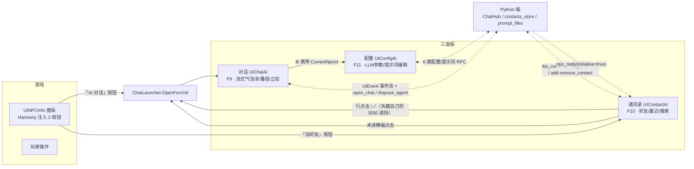

# 游戏内 UI 全景：对话 · 配置 · 通讯录三面板 —— 架构 / 游戏·Python 关系 / 工具联动 / 原剧情拦截

> **定位**：本文档是 **UI 相关的唯一详细文档**。README 只留概览；一切 UI 细节都在这里：
> ① 三面板（对话 UIChatAi / 配置 UIConfigAi / 通讯录 UIContactAi）的内部结构与数据流；
> ② 三面板之间的关系（入口互跳、上下文传递、未读联动）；
> ③ 它们与**游戏**的关系（双宿主、Harmony 注入、消费的原生 API、渲染层级）；
> ④ 它们与 **Python 端**的关系（单 WS 连接上的全部 RPC 与事件、pending 延迟回灌）；
> ⑤ 工具调用 → 游戏联动（论道/行为/社会关系确认窗）与原剧情拦截规划；
> ⑥ UI 事件系与委托桥实证、关键类速查、真机验收清单。
>
> **证据基线**：所有类名/方法名/签名来自 `cpp2il_out\Assembly-CSharp.dll` 反射（14628 类型）、
> `F:\DecompDump\dump\*.txt`（互操作反编）与 `F:\ggbh_mod_analysis\*.txt`（神识传音 IL 实录）。
> 游戏为 Unity IL2CPP，mod 经 MelonLoader 加载，托管互操作层在 `MelonLoader\Managed`。

---

## 0. 一句话结论

- **UI 技术栈**：全部 Unity UGUI（`UnityEngine.UI`），无玩法级 IMGUI；游戏自带 `UIOperationGroup` 按钮组是"往现有界面加按钮"的官方化入口。
- **三面板双轨制**：每个面板 = 代码构建器（`*UiBuilder.Build()`，同时是预制件的"源文件"）↔ AB 预制体（编辑器生成/手改 → `ABBuildRunner` 打包 → `ModRes`）两条样式路线，业务只写一份（`*Presenter`），靠 **`*PanelRefs` 路径契约**解耦。
- **工具联动论道**：`WorldUnitAIAction1037.ActionStart()` 一调，游戏**自己弹原版论道 UI 并结算**——联动自动发生，我们只需让 AI 知道结果（§8）。
- **社会关系确认窗**：原生 `UICheckPopup` 确认窗（曾用 `UICustomDramaDyn`+私有 ID，09-11 换型，见 §9 勘误），点选结果经 `DramaGate` 延迟 response 回灌 LLM（§9）。
- **拦截寻仇/攻击**：NPC 原生交互汇聚于 `DramaTool.OpenDrama`，Harmony patch 可拿原文/抑制原 UI（§10，规划）。

---

## 1. 三面板总览与相互关系

### 1.1 一览表

| | 对话 UI | 配置 UI | 通讯录 UI（传音簿） |
|---|---|---|---|
| 预制体 / bundle | `UIChatAi.prefab` / `uichatai.ab`（已部署） | `UIConfigAi.prefab` / `uiconfigai.ab`（已部署） | `UIContactAi.prefab`（已生成）/ `uicontactai.ab`（**未打**） |
| Canvas sortingOrder | 3000 | 3100 | 3050 |
| 热键 | F9 | F11 | F10 |
| 控制器 | `ChatPresenter` | `ConfigPresenter` | `ContactPresenter` |
| 视图 | `ChatWindow` + `ChatItemViews` | 无独立视图类（Builder 直建） | 无独立视图类（Builder 直建） |
| 协议 | UiEvent 事件流 + open_chat/dispose_agent 生命周期 | 6 类配置 RPC | list_contacts / list_sessions / add_contact / remove_contact |
| AB 宿主 | `AbChatPanel`（已启用，无代码回退） | `AbConfigPanel`（AB-only，失败报错不回退） | `AbContactPanel`（常驻宿主，已接线；`uicontactai.ab` 待打包拷入 ModRes） |
| 当前对话对象 | `CurrentNpcId` | `_currentNpcId`（⚙ 传入） | 行点击目标 |

### 1.2 关系图



### 1.3 关系细述

1. **`ChatLauncher` 是对话 UI 的唯一入口**：NPC 面板「AI 对话」按钮、通讯录行点击/✓、未读横幅点击、当面弹出——全部汇到 `ChatLauncher.OpenForUnit(unit)`，内部按 `AB_UI` 分流（AB → `AbChatPanel.InitData`；代码版 → `PresenterInstance.OpenForNpc`）。入口统一意味着生命周期（开窗激活/关窗销毁）只有一处实现。
2. **npcId 上下文随入口流动**：对话窗携带 `CurrentNpcId`（中文名，Python 会话/人设的键）；标题栏 ⚙ 打开配置面板时把它传下去（`ConfigPanelOpener.Toggle(npcId)`）→ 配置面板 `list_prompts` 只列"全局 + 该 NPC"文件、新建人设按钮直接显示"为「X」新建人设"（不再手输）。
3. **未读联动（`UnreadStore` 静态信箱）**：NPC 主动传音（`npc_reply(initiative=true)`）三分流（§7.5）——对话窗开着=直播已读；**同格+玩家空闲+没开别的对话窗=当面弹出对话 UI**；其余=登记未读（通讯录行红点 `UnreadDot` + Canvas 顶部横幅 `UnreadBanner`）。点横幅/点行打开对话即 `Clear` 已读。
4. **通讯录 → 对话的遮挡处理**：通讯录 Canvas 3050 高于对话 3000，`OpenChatFor` 先 `Hide()` 自己再 `ChatLauncher.OpenForUnit`，防自建 Canvas 盖住对话窗。
5. **加好友闭环**：NPC 面板「加好友/移除好友」按钮（`NpcPanelAddContact`）→ `ContactPresenter.ToggleManualContact` → `add/remove_contact` RPC → Python `contacts.json`；`ManualContactNames` 镜像同时供 `NpcInitiativeMonitor` 作主动开口候选④。
6. **渲染层级**：对话 3000 < 通讯录 3050 < 配置 3100。配置面板最后关、永远在最上。

---

## 2. 与游戏的关系

### 2.1 双宿主：代码版与 AB 版

| | 代码版 | AB 版 |
|---|---|---|
| 宿主方式 | Builder 建整棵 Canvas 挂 `g.root.transform`（随游戏持久） | `g.ui.OpenUI(new UIType.UITypeBase("UIChatAi", (UILayer)0))` 官方 UI 栈，`AddComponent<*Panel>()` 装配 |
| 基类 | `MonoBehaviour` | `UIBase`（游戏窗口基类，随 UI 关闭回收） |
| 生命周期 | 插件 Init 时常驻；F 键开关 | 每次开窗实例化；面板销毁即回收 |
| 样式来源 | Builder 代码（程序纹理 `MakeSlicedSprite`/`MakeCircleSprite`） | 预制体（编辑器手改/生成，进 bundle） |
| 注意 | `UITypeBase` 是 `UIType` 的**嵌套类型**（互操作程序集无顶层 `UITypeBase`）；自定义 MonoBehaviour 必须先 `ClassInjector.RegisterTypeInIl2Cpp`（ModMain 统一注册：ChatWindow/ChatPresenter/ConfigPresenter/ContactPresenter/HoverTip + Ab*Panel） |

### 2.2 游戏原生 UI 挂点：Harmony 注入

`[HarmonyPatch(typeof(UINPCInfo), nameof(UINPCInfo.InitData))]` **Postfix**（面板每次初始化必经，比监听 `OpenUIEnd` 少一层时序竞争；神识传音用 `g.events.On(EGameType.OpenUIEnd)` 是等价替代）。两个注入器：

- `NpcPanelButton`：「AI 对话」按钮 → `ChatLauncher.OpenForUnit(panel.unit)`；
- `NpcPanelAddContact`：「加好友/移除好友」按钮（切换语义）→ `ContactPresenter.ToggleManualContact(name)`。

共同手法：克隆操作组现成按钮（样式/字体/布局全套继承）→ `NpcPanelButton.StripOperationItem` 销毁克隆体上残留的 `UIOperationItem`（防游戏按钮组逐帧 `UpdateHandleInput` 当自己的选项驱动）→ `ClickUtils` 三步写法挂回调 → 回调时**现读** `panel.unit`（面板复用于其他 NPC 时不捕获旧值）。`UINPCInfo` 面板还有大量 `UIOperationGroup` 插槽（`opGroupRoot/Left/Prperty/Skill/Prop/...`），`UIOperationGroup.Add/OperationButton` 是官方化另一入口。

- `MapMainContactButton`：「传」字圆钮注入主界面 HUD——Postfix `UIMapMainPlayerInfo.Init(Transform)`（玩家头像区面板，反编实证其下有 OnBagClick/OnEmailClick/OnMinMap 等圆钮回调）；按名深搜现成圆钮克隆（信件类图标优先→背包/任务→任意 Button），环形步长取相邻钮位置差自动排布，点击 → `ContactPanelOpener.Toggle()`（通讯录 AB 未就绪时由 Opener 报错，无回退）。

### 2.3 渲染层级与画布

- 三面板各自独立 Canvas（ScreenSpaceOverlay + CanvasScaler 1920×1080 + GraphicRaycaster），sortingOrder 3000/3050/3100；配置面板恒在最上。
- 通讯录有全屏 `Dim` 遮罩（0.45 黑，盖住世界），点击可穿透到面板关闭逻辑；窗口与遮罩默认隐藏、`Show()/Hide()` 点亮。
- 列表裁剪：ScrollRect + Viewport(RectMask2D) + Content(VerticalLayoutGroup + ContentSizeFitter Preferred)——行多自动出滚动量（通讯录/配置文件列表/对话消息区同构）。

### 2.4 消费的游戏原生 API

| 消费点 | 游戏原生 API | 用途 |
|---|---|---|
| 立绘（对话窗左右 + 通讯录头像） | `PortraitModel.CreateTextureInModelData(propertyData.modelData, RawImage, 偏移, 缩放, …)`；特殊剧情 NPC 走 `g.conf.dramaNpc.CreateTexture(GetFiveFlowerDramaNpcID(unit), …)` 兜底（神识传音传音窗 IL 实录） | 运行时把单位半身立绘渲进 RawImage，零图片素材 |
| 社会关系确认窗 | `g.ui.OpenUI<UICheckPopup>(UIType.CheckPopup).InitData(...)`（§9，09-11 换型） | 原生确认弹窗（正文 100% 代码填；曾用 UICustomDramaDyn 因配置表缺条目弃用） |
| 关系建立/解除 | `UnitActionRelationSet` / `UnitActionRoleBreakWith.Init(对方)` / married 互写 + `DramaTool.OpenDrama(22201)`（§9） | 确认窗回调直改字段 |
| 行为发起 | `WorldUnitAIAction1031/1037/1044/1034/1041`、`UnitActionRoleDrill/Attack/Invite/TeachSkill`（§8） | 论道/双修/切磋等 8 op |
| 关系网采集 | `relationData` 十容器 + `GetIntimUnitData().friendUnits/enemyUnits` + `GetAllGoodRelationUnitID(true,true)` + `g.world.unit.GetUnits` 同格遍历（`RelationNetwork`） | 通讯录好友层① + 主动开口候选 |
| 好感/关系读取 | `GetRelation` / `GetIntim` / `g.conf.roleGrade.GetGradeName` / `UnitSnapshot.SectName` | 通讯录副标题"宗门·境界 · 关系 好感" |
| 官方 AB 打包 | `ResBuildABProject` 工程 + `ABBuildRunner.cs` | prefab → 自包含 bundle（chat 含背景图同包） |

---

## 3. 与 Python 端的关系

### 3.1 通道模型

单条 WebSocket（Python `WsServer :8766`，C# `WsClient` 客户端）全双工，两类帧：

- **`request/response`（双向，req_id 配对）**：Python→C#（get_context/call_tool）；C#→Python（下表 RPC，`WsClient.SendRequest(method, parameters, onResponse, timeout)`，回调恒转主线程；超时合成 `{"ok":false}` 错误帧）。
- **`event`（C# 订阅 `WsClient.UiEvent` 主线程广播）**：player_message / npc_initiative / step / text_delta / npc_reply。

### 3.2 RPC 总表（C# → Python）

| 面板 | method | 时机 | 说明 |
|---|---|---|---|
| 对话 | `open_chat` | 开窗/换 NPC | **激活**该 NPC 的 agent（磁盘账本自动 resume）并返回历史投影 `items`（= 旧 get_history 形状），竞态时放弃重放、直播优先 |
| 对话 | `dispose_agent` | 关窗 | 落盘销毁活体（回合在跑由 Python 延至回合毕）；fire-and-forget |
| 对话 | `get_history` | （旧接口，被 open_chat 取代） | UI 历史投影 |
| 配置 | `get_config` / `set_config` | 开面板 / 保存 | 分块配置；`set_config` 返回 `effective`（hot/restart/mixed/none），llm 块 `LlmRouter.swap` 热切换 |
| 配置 | `list_prompts` | 开面板/新建后 | 文件枚举（带 npc_id 过滤=全局+该 NPC；**每项带 `desc` 一句话作用说明**，供悬停气泡） |
| 配置 | `read_prompt` / `write_prompts` | 选文件 / 保存 | 读单文件 / 批量写 `{files:{path:text}}`（兼容旧单条 `write_prompt`） |
| 配置 | `create_persona` | 新建人设按钮 | npc_id 取自上下文（非手输） |
| 通讯录 | `list_contacts` / `add_contact` / `remove_contact` | 开面板 / 加好友按钮 | Python `contacts.json`（`contacts_store.py` 唯一读写口） |
| 通讯录 | `list_sessions` | 开面板 | 会话索引（npc_id → jsonl mtime），「最近」Tab 排序源 |
| 桥 | `get_context` / `call_tool` | Python 回合内 | 非面板；见 §8/§9 |
| 确认窗 | （call_tool 延迟 response） | 玩家点选后 | §9 的 DramaGate 机制，Python 零改动 |

### 3.3 事件表（Python → C#，经 `UiEvent` 广播）

| event | 消费者 | 行为 |
|---|---|---|
| `player_message` / `npc_initiative` | （发起方事件，UI 不消费） | — |
| `step`（kind=tool_call/tool_result/think/text） | ChatPresenter | tool_call/result → 回合折叠组；think → 「内心思量」折叠区；text → 非流式整泡（`_sawDelta` 防与流式重复） |
| `text_delta`（part=body/think） | ChatPresenter | body → 流式气泡（delta 逐帧合并）；think → 折叠区涨字 |
| `npc_reply`（initiative/error） | ChatPresenter + ContactPresenter | 对话窗：定稿气泡/错误系统提示；通讯录：互动时间戳 + **initiative 三分流**（§7.5） |

过滤规则：ChatPresenter 只处理 `npc_id == CurrentNpcId` 的事件（多 NPC 并行回合各归各）；窗口未开时事件直接丢弃（关闭期对话由 open_chat 回放补齐，与直播不交叠）。

---

## 4. 双轨制：代码构建器 ↔ AB 预制体

### 4.1 管线与契约

```
*UiBuilder.Build(parent) ──代码搭整棵树──► *PanelRefs（路径契约，纯数据类）
        │                                      ▲
        └─(编辑器菜单 Build*Prefab)──► UI*.prefab（可再手改美化）
                                          │ ABBuildRunner（自包含 bundle）
                                          ▼
                                   ModRes\AssetBundle\ab\ui\*.ab
运行时 AB 版：g.ui.OpenUI → *Panel.CollectRefs(transform) 按【同一份路径契约】Find → 同一个 *Presenter
```

- **契约即解耦**：节点名/层级是唯一的"接口"（如对话 `BG/Scroll/Viewport/Content`、配置 `BG/PageLlm/*Row/Input`、通讯录 `BG/ContactItem` 模板）；预制体可以任意美化，只要不改名/层级，Presenter 零感知。路径缺失返回 null，Presenter 按缺失容错（如 ConfigButton 未加则 ⚙ 不出现）。
- **MUD_UI 镜像**：`ui_preview/Assets/MUD_UI/` 是 `csharp/UI/` 纯 Unity 依赖文件的拷贝（预览工程编译用），改代码侧后需 `cp` 同步（部分文件曾是硬链，编辑器原子替换会断链，统一以 cp 为准）。
- **编辑器工具菜单**（`Assets/Editor/`）：`BuildConfigPrefab` / `BuildContactPrefab`（从 builder 重新生成 prefab——**会覆盖手改**）、`AddConfigTooltip` / `AddChatPortraitSlots`（向 prefab **追加**节点，幂等不覆盖）、场景预览菜单。

### 4.2 三面板现状

| 面板 | 代码版 | AB 版 | 备注 |
|---|---|---|---|
| 对话 | 保留（仅预览/生成器职责，`!AB_UI` 构建才常驻） | **已启用，无代码回退**（按需求） | 预制体含立绘占位（补占位菜单） |
| 配置 | 仅 `!AB_UI` 构建常驻；AB 构建不建（防双 presenter 同帧双轮询 F11 互抵） | 已部署、**AB-only 失败报错不回退**；YAML 原位手改过（NewNpcInput 隐藏/按钮拉伸/气泡模板） | 生成菜单会覆盖手改——手改后**勿再跑生成菜单**，追加类菜单（补气泡）幂等 |
| 通讯录 | 仅 `!AB_UI` 构建常驻；AB 构建已停建 | **已接线**（`AbContactPanel` 常驻宿主，AB-only 失败报错；`uicontactai.ab` 待打包拷入） | AB 化后改样式才走"改预制件→重打"循环 |

### 4.3 工程约定（IL2CPP 实证，全文见 §11）

- 挂按钮回调一律**三步写法**（`System.Action → UnityAction.op_Implicit → onClick.AddListener`，封装为 `ClickUtils.Attach`）；直接 `AddListener(() => {})` 会 CS1660。
- UnityEvent 家族（`onValueChanged/onEndEdit`）在 IL2CPP 下不可靠：先转存 `System.Action<string>` 再 AddListener（ConfigPresenter/ContactPresenter 同款）。
- InputField 的 onSubmit 不可靠：ChatPresenter 在 `Update` 里轮询 `isFocused + Enter` 提交。
- 遍历子节点用索引循环（`childCount + GetChild`），`foreach(Transform)` 抛 InvalidCastException；取组件统一 `GetComponent<T>()`。
- 精灵生成器两约定：`MakeSlicedSprite` 已钳制 `border < size/2`（越界 → 切角覆盖整张纹理 → 精灵全透明/方形元素「十字」化——通讯录透明背景事故根因）；**圆形一律 `MakeCircleSprite`** 逐像素抗锯齿真圆。字体三级兜底（游戏现成 Text 字体 → OS 动态字体 → LegacyRuntime.ttf）。

---

## 5. 对话 UI（UIChatAi）

### 5.1 入口与生命周期

```
入口：F9（窗口开过一次后）/ NPC 面板「AI 对话」/ 通讯录行·✓ / 未读横幅 —— 全部 → ChatLauncher.OpenForUnit
开窗：OpenFor(npcId) → UnreadStore.NotifyChatOpen（登记当前对话对象 + 清该 NPC 未读）
      → open_chat RPC：激活 agent（磁盘账本自动 resume）+ 历史投影回放（竞态：直播优先，放弃重放）
关窗：✕ / F9 → UnreadStore.NotifyChatClosed → dispose_agent RPC（落盘销毁；重开自动 resume）
```

已知取舍：窗口未开时到达的直播事件直接丢弃（不做离线缓存），由 open_chat 回放补齐；AB 模式无全局常驻 Presenter，NPC 主动传音若发生在从未开过任何面板时由通讯录侧兜底（§7.5）。

### 5.2 文件分工

| 文件 | 职责 |
|---|---|
| `ChatWindowRefs` | 引用契约（纯数据）：canvas/window/标题 NPC 输入框/closeBtn/configBtn/scroll/viewport/content/输入栏/sendBtn/busyLabel + 5 行模板（User/Npc/StepGroup/System/Divider）+ 立绘占位 ×2 |
| `ChatUiBuilder`(+`ClickUtils`) | 代码搭树（Canvas 3000、Window 右中 520×760、消息滚动区、输入栏、行模板藏 Root 下）；配色/字体/精灵生成器集中地；`ClickUtils` 三步写法 |
| `ChatItemViews` | 行视图：ChatBubble（用户右/NPC 左）、StepGroup（回合过程折叠组，AddCall/AddResult）、ThinkGroup（内心思量折叠区）、ChatDivider（"—— 主动传音 ——"） |
| `ChatWindow` | 视图门面：追加行/流式（**delta 逐帧合并** LateUpdate 一次刷 Text）/行上限 200 裁最旧/**智能滚底**（贴底才跟随）/ReplaceHistory 回放/立绘槽位装配 |
| `ChatPresenter` | 控制器（§5.3）：**全工程唯一认 WS 对话协议的类** |
| `NpcPanelButton` | Harmony 注入「AI 对话」按钮（§2.2） |
| `AbChatPanel` | AB 宿主：OpenUI → CollectRefs → 挂 ChatWindow+ChatPresenter → OpenForNpc → FillPortraits；OnDestroy 兜底 dispose_agent |
| `PortraitService` / `PortraitLeft/Right 占位` | 立绘（§5.4） |

### 5.3 渲染数据流（协议翻译）

```
用户输入 → AppendUserMessage 本地回显 → SendPlayerMessage(npc, msg) → Python 回合
Python 事件 → UiEvent（主线程）→ ChatPresenter 按 npc_id 过滤 → 翻译：
  step(tool_call/tool_result) → BeginTurnProcess/AddCall/AddResult（折叠组）
  step(think) / text_delta(part=think) → ThinkGroup 内心思量折叠区
  text_delta(body) → FinishThink + FinishStepProcess → BeginNpcBubble + AppendDelta（逐帧合并刷屏）
  step(text)（stub/echo 非流式）→ _sawDelta 未见过 delta 才渲染（防重复）
  npc_reply → FinishNpcBubble 定稿 / error → CancelActiveBubble + 系统提示（账本不留 assistant）
```

视图侧三性能措施：delta 逐帧合并（LateUpdate 一次刷）、行上限 200 裁最旧、智能滚底（贴底才跟随）。

### 5.4 立绘

- **槽位**：预制体占位优先（`BG/PortraitLeft`|`Right`，RawImage，位置/大小/层级完全以预制体为准，经「为对话面板补立绘占位」菜单添加，raycast 关闭不挡气泡/滚轮）；缺失时 `ChatWindow` 运行时现造兜底（170×230、上部左右、稍出面板上缘）。
- **纹理**：`PortraitService.Fill(unit, rawImage)` → `PortraitModel.CreateTextureInModelData(propertyData.modelData, rawImage, (0,-4.5), 1f, false, true, null)`；特殊剧情 NPC 走 `g.conf.dramaNpc.CreateTexture(GetFiveFlowerDramaNpcID(unit), …)` 兜底。**左 NPC / 右玩家**（对齐气泡方向；神识传音是反的）。失败自动隐藏槽位。
- 取景参数 `ModelOffset/ModelScale` 集中可调；真机验证点见 §13.3。

### 5.5 未读联动

开窗 → `UnreadStore.NotifyChatOpen(npc)`（登记 ActiveChatNpc + 清该 NPC 未读）；关窗 → `NotifyChatClosed`。这让通讯录的"当面弹出/已读"判定有了权威来源（§7.5）。

---

## 6. 配置 UI（UIConfigAi）

### 6.1 入口与 npcId 上下文

F11（无上下文=全局视图）或对话窗标题栏 ⚙（`ConfigPanelOpener.Toggle(npcId)`，携带 `CurrentNpcId`）。`ShowPanel(npcId)` 决定两件事：`list_prompts` 只列"全局 + 该 NPC"文件；新建人设按钮文案"为「X」新建人设"、点击直接用上下文名（F11 全局视图无名字 → 状态栏提示"请从对话内 ⚙ 打开"）。原手输 NPC 名输入框已弃用（预制件隐藏、builder 同步）。

### 6.2 文件分工

`ConfigPanelRefs`（契约：11 输入框 + 2 Toggle + 双 Tab + 文件列表/多行编辑 + 悬停气泡模板）→ `ConfigUiBuilder`（Tab1 大模型+主动开口节流表单 / Tab2 提示词文件列表+多行编辑+新建人设）→ `ConfigPresenter`（RPC + 校验 + 悬停登记）→ `AbConfigPanel`（AB 宿主，单例 `_current`）→ `ConfigPanelOpener`（F11/⚙ 统一路由：AB-only，失败只报错不回退；代码版 ConfigUiBuilder.Build 仅 `!AB_UI` 构建常驻——AB 构建若再建常驻 presenter 会与 AB 面板 presenter 同帧双轮询 F11，两次 toggle 互抵致关不上面板）。

### 6.3 RPC 与校验

- 开面板：`get_config` 回填（llm/network/initiative **六项**（09-13 起含 `enabled`）/compaction **四项**（`ctx_window`/`retain_ratio`/`threshold_ratio`/`enabled`）/`ui.portraits_enabled`）+ `list_prompts` 回填文件列表；保存：`set_config`（按 `effective` 提示 hot/restart/mixed/none）+ `write_prompts` 批量（全量缓存一次提交）+ `create_persona`。**09-13 起除 `network.port` 外全部热生效**：`initiative.*` 与 `ui.portraits_enabled` 由 C# 在保存后重拉 `get_config` 落地，`initiative.min_interval` 与整块 `compaction` 由 ConfigService 热应用（重建 Compressor）。大模型页同时改为 4 组标题条 + 18 行常显 + 整页滚动（`BG/PageLlm/Scroll/Viewport/Content`）。
- 数字输入**严格校验**（`TryParseIntStrict` 等：非法显式报错，不静默回退默认，防误重置）；api_key Password 掩码。
- 提示词文件列表每行点击 → `read_prompt` 回填右侧多行编辑框（编辑内容进全量缓存，切文件不丢）。

### 6.4 悬停气泡（HoverTip）

- 引擎 `HoverTip`（纯 Unity 视图件，`ui_preview` 预览工程共用）：`Register(rect, text)` 登记悬停区 → Update 轮询 `RectangleContainsScreenPoint`（IL2CPP 不用接口注入）→ 悬停 0.3s 浮出 → 跟随鼠标右下 → 贴边翻转 → 移出/页隐藏收起。气泡本体：预制体 `BG/Tooltip` 模板优先，缺失 `ConfigUiBuilder.BuildTooltipTemplate` 现造。
- 文件行说明：Python `list_prompts` 每项 `desc` 下发（`prompt_files._describe`，四类：世界观 sections / npc人设 personas / 人设尾部追加 _suffix / npc特点 traits / 压缩 compaction）；缺失时 C# 分组规则兜底。
- 参数行说明：13 条固定文案在 `ConfigPresenter.RegisterFormTooltips`（每条"是什么 + 何时生效"）；悬停区 = 整行（输入框/开关的父节点）。
- **相机与坐标系（09-13 真机定案，两条都会静默失效——详见 APPENDIX D.5）**：检测用的 `RectangleContainsScreenPoint` / 定位用的 `ScreenPointToLocalPointInRectangle` **必须传对画布相机**——Overlay 传 `null`、`ScreenSpaceCamera`/`WorldSpace` 传画布相机。**AB 面板的 Canvas 是游戏 UIMgr 挂的（真机 `ScreenSpaceCamera`），代码自建面板才是 Overlay**，所以相机由 `ResolveCamera()` 运行期从画布解析，不写死 `null`；气泡锚点也要 `= 画布 pivot`（`anchoredPosition` 的原点是自身锚点，写死 `(0.5,0.5)` 会整体偏半个画面）。装配/登记/首次命中各留一行日志，便于下次一眼定位。

---

## 7. 通讯录 UI（UIContactAi / 传音簿）

### 7.1 入口与装配

F10（`ContactPresenter.Update` 轮询 → `ContactPanelOpener.Toggle`）+ 主界面 HUD 头像区「传」字圆钮（`MapMainContactButton` 注入，§2.2）+ 未读横幅等外部入口。AB 构建：`AbContactPanel` 常驻宿主（g.res.Load 预制件一次性装配，失败报错不回退）；`!AB_UI` 构建：代码版 `ContactUiBuilder.Build` 常驻。

### 7.2 数据两层（好友语义 = 玩家认识的 NPC，非全图筛选）

1. **关系层（本地同步采集）**：`RelationNetwork.CollectKnownUnits`——五源合一：①关系十容器（parent/children/brother/brotherBack/lover/master/student/married/parentBack/childrenBack）②好友簿 ③**仇人簿**（IntimUnitData.enemyUnits）④关系记录簿兜底 `GetAllGoodRelationUnitID(true,true)`；每源独立 try/catch、按 unitID 去重、排除玩家/空名。副标题负好感显示"仇敌"。
2. **手动层（RPC 异步）**：`list_contacts` → Python `contacts.json`（`contacts_store.py` 唯一读写口）→ 按中文名并入（关系层优先、手动层补缺；解析失败的显示"人物档案缺失"，点开时延迟再解析）。

合并后拼音序（zh-CN 文化排序，异常回退码位序）。

### 7.3 Tab / 搜索 / 渲染

- **好友 Tab**：合并全量，字母序；**最近 Tab**：通讯录 ∩ 互动记录（`list_sessions` 的 jsonl mtime ∪ 本地 npc_reply 时间戳取大）倒序前 30。
- **搜索**：🔍 点开才占位的搜索覆盖层，`onValueChanged` 本地子串过滤（名字/副标题），非空跨两 Tab 搜全量——零 RPC；关闭时清空恢复全量。
- **渲染**：仿 ConfigPresenter.RebuildFileList——清旧行 → 模板克隆（上限 `MAX_ROWS=50`，超出靠搜索精确定位）→ 填 Name/Sub/UnreadDot → 行点击与 ✓ 同一动作（传音）→ 头像立绘入队。
- 行模板契约：`BG/ContactItem`（隐藏）→ 投影层 + `Card` + `Avatar/Portrait`（圆形 Mask 裁切立绘）+ `Name` + `Sub` + `UnreadDot`（未读红点，默认隐藏）+ `ChatBtn`（✓ 青绿正圆）。

### 7.4 立绘懒渲染（UnitPortrait）

RenderTexture 是重资源，逐行直渲会卡：**懒渲染**（只渲实际显示的行）+ **按 NPC 名缓存 RT**（上限 64，超限整批回收）+ **每帧配额 1 张**（`ContactPresenter.Update` 取队首）+ **生命周期归面板**（Hide 时 `ReleaseAll`）。底层统一走 `PortraitService.Fill`。对话窗左右立绘（一次两张、无复用）不经本类。

### 7.5 主动传音三分流（`OnUiEvent`，npc_reply initiative=true 且非 error）

```
对话窗开着且就是该 NPC ────────────► 直播已读（不登记）
与玩家同格 && 玩家空闲 && 没开别的对话窗 ──► 当面弹出对话 UI（ChatLauncher.OpenForUnit）
其余（异地 / 忙 / 开着别的 NPC）──────► UnreadStore.Mark（行红点 + 顶部横幅 8s 自动隐藏）
```

- 消息本体永远在该 NPC 的 session 账本（主动开口回合正常落账），`UnreadStore` 只是客户端"没看过"标记，不持久化（重启红点消失，历史仍可回放）。
- "玩家空闲"判定：`NpcInitiativeMonitor.IsPlayerBusy()`；"同格"：`UnitSnapshot.IsSameGrid`。
- 横幅整条可点 → 打开最新未读 NPC 对话；文案显示"N 条未读"或 24 字预览。
- 设计细节见 `README.md` 附录二 G（功能设计底稿）。

### 7.6 手动好友

`NpcPanelAddContact`（Harmony 注入，切换语义"加好友/移除好友"）→ `ToggleManualContact` → `add/remove_contact` RPC（真相在 `contacts.json`）→ 回包重拉镜像重渲；`IsManualContact/ManualContactNames` 对外（后者供主动开口候选④）。

### 7.7 AB 化（代码接线已完成，ab 打包待拷）

当前预制体（UIContactAi.prefab）已生成未打包且已对齐 `ContactUiBuilder` 现状（自检+补齐完成：UnreadBanner 子树、Avatar 圆形 Mask+Portrait 子节点、ContactScroll m_Viewport 接线）。五步进展：① 预制体自检 ✅ ② 打包 ✅规则确认——`CreateAssetBundleEditor`（游戏工程/打包/生成AB）自动打包 Resources 下全部预制件，**无需加 ContactBundle 段**，产出 `uicontactai.ab` 拷入 `ModRes\AssetBundle\ab\ui\` 即可（待执行）③ `AbContactPanel` ✅——**常驻宿主形态**：Init 时 `g.res.Load<GameObject>("UI/UIContactAi")`（官方 Example 实证的 AB 加载口子）→ Instantiate 挂宿主 → CollectRefs 16 条路径 → 挂常驻 `ContactPresenter`；不照抄 AbChatPanel 的按次 OpenUI 模式，因 ContactPresenter 的未读三分流/F10 轮询/横幅计时/立绘懒渲染队列/加好友回调都是常驻职责，按次开关即销毁会全断；关键节点缺失或加载失败→记日志拒绝装配，**无代码版回退** ④ `ContactPanelOpener` 无需改动——它只认 `ContactPresenterInstance`，装配后引用照旧 ⑤ `ModMain` ✅——AB 构建停建代码版树，改走 `AbContactPanel.TryCreate`。完成后换样式 = 改预制件 → 点「生成AB」→ 拷 ab（不再动 C#）。

---

## 8. 工具调用 → 游戏联动（论道与行为）

### 8.1 论道落点 = `WorldUnitAIAction1037`（神识传音 IL 实证）

```
Python: call_tool("world_ai_action", {op:"lun_dao", target:"林婉清"})
  → WS request call_tool → C# ToolExecutor.Execute(...)（主线程）
  → var ai = new WorldUnitAIBase(); ai.Init(林婉清);
  → var action = new WorldUnitAIAction1037(); action.toUnit = g.world.playerUnit;
  → action.Init(ai, 1, null); action.ActionStart(onEndCall);
  → 游戏自己弹原版论道 UI 并结算（经验/道点/瓶颈松动）
```

**联动本质**：原生动作类自己打开原版 UI——不需要我们"触发它的 UI"，只需让 AI 从 tool/result 得知结果。

### 8.2 world_ai_action 八 op 落点映射（已全部实装）

| op | 落点（神识传音确认闭包） | 约束 |
|---|---|---|
| shuang_xiu 双修 | `WorldUnitAIAction1031` + toUnit=玩家 | 同格+异性+好感≥120 |
| lun_dao 论道 | `WorldUnitAIAction1037` + toUnit=玩家 | 可远程 |
| yao_yue 邀约 | `WorldUnitAIAction1044` + toUnit=玩家 | 异性+好感≥120 |
| liao_shang 疗伤 | `WorldUnitAIAction1034`（ai.Init(目标)） | 目标状态差 |
| ti_sheng_xin_qing 提升心情 | `WorldUnitAIAction1041`（ai.Init(目标)） | 目标心情差 |
| spar 切磋 | `UnitActionRoleDrill` + CreateAction(act, true) | 同格 |
| attack 攻击 | `UnitActionRoleAttack` | 触发战斗 UI 战后自然结算 |
| chuan_gong 传功 | `UnitActionRoleTeachSkill(player, skillData, TeachType.Teach)` + `SkillCanTeach` 校验 + `ResolveMartial`（按功法 ID/中文名五槽位匹配） | 同格 |

通用模式：`new WorldUnitAIBase().Init(actor)` → `new WorldUnitAIActionXXXX{toUnit=…}.Init(ai,1,null).ActionStart(cb)`；回调已实装（`DelegateSupport.ConvertDelegate<Il2CppSystem.Action<bool>>` 真实空回调——真机实证 1044/1034/1041 内部调回调、null 直接 NRE，1037 容忍 null）。结算数值捕获/推事件仍是后续增强。

### 8.3 其余工具的游戏落点

`social_relation` 13 op（好感直写 + 确认窗，§9）；`economy_item`（灵石 `RewardPropMoney/CostPropItem(10001)` + 普通道具 `UnitActionRoleGive`）；`trade`（买卖直改字段：`DataProps.DelProps/AddProps` 搬道具 + `CostPropItem(10001)/RewardPropMoney` 搬灵石，确认窗复用 economy 段）；`item_acquire`（`UnitActionRoleStealItem/Askfor`）；`movement`（`UnitActionMovePlayer/MoveNPC`）。映射表与 IL 证据汇总于 §13.1/13.2。

---

## 9. 社会关系确认窗：原生 UICheckPopup + DramaGate

> **★09-11 勘误（换型）★**：本节以下描述的 `UICustomDramaDyn + ModIds 私有 ID 段` 方案**已废弃**。
> 真机实证：该窗要求 `DramaDialogue` 配置表已有该 ID 条目——`OpenUI → DramaTool.OpenDrama →
> RandomDramaID` 查表未命中时打 `"找不到剧情ID：xxx"` 后**静默不开窗**（调用方无从感知）→
> DramaGate 干等 120s 超时。本 mod 无剧情配置文件，2_000_000_100 段从未注册，09-11 首次真机
> 触发（NPC 赠灵石）即爆。神识传音 mod_ID 私有段可行是**因为它带剧情/配置数据文件**（注册了
> 1945667223+X 条目，见 `_ss_modmain.cs:1125 GetItem(mod_ID+2)`），并非"私有 ID 天然可行"。
> 现窗体：`g.ui.OpenUI<UICheckPopup>(UIType.CheckPopup).InitData("提示", 正文, 2, 确定回调, 取消回调)`
> （官方 Example/神识传音同款，纯代码零配置依赖）；`ModIds` 段常量保留作 DramaGate 撞窗 key。
>
> **09-11 下午二次勘误（最终态）**：经官方模组编辑器导出配置表（MID=**-803158451**；工程
> `F:/mod/ModProject_Jgmg5L`，ModExcel 三张表=8 窗/16 选项/24 文本键；`1b8bg-` 加密）后，
> **`UICustomDramaDyn` 恢复为确认窗主方案**（NPC 立绘+自定义按钮文案），UICheckPopup 弃用；
> 用户拍板**不设降级路径**（表缺失=120s 超时暴露问题）。硬规则：①**ModExcel 的 json 必须由
> 编辑器导出**——手写明文会让游戏启动时 ModImportTool 解析炸、阻断启动；②C# `ModIds.Mod`
> 与工程 xlsx 的 `MID&偏移` 必须同源同步；③编辑器"重置ID"按钮永远不要点。

### 9.1 为什么弃用原生关系剧情（真机实证 2026-09-03）

`UnitActionRoleRelation` 弹的原版剧情窗**正文空白、选项有字**——选项文字直接取自 `ConfRoleRelationItem.acceptText/rejectText`，正文走"按剧情 ID 查配置表"的渲染链，dummy id（9000+type）永不命中 → 正文恒空。整条原生剧情路径弃用。

### 9.2 新范式（对标神识传音 `ShowActionDrama`，逐条同构）

| 步骤 | 神识传音（IL 实录） | 我们 `ShowDramaService.ShowConfirm` |
|---|---|---|
| 建窗 | ~~`new UICustomDramaDyn(mod_ID+1)`~~ | **已换型** `g.ui.OpenUI<UICheckPopup>(UIType.CheckPopup).InitData(...)`（09-11；旧法需剧情配置表条目，见节首勘误） |
| 正文 | `dialogueText[窗ID] = String.Format(...)` | `dialogueText[窗ID] = text`（模型 ask_text 或兜底文案） |
| 选项 | `dialogueOptions[id] = …` | `dialogueOptions[optOk/optNo] = accept/reject` |
| 挂回调 | `SetOptionCall(id, …)` | `SetOptionCall(optOk/onOkCb)`（`System.Action` 走 `op_Implicit` 隐式桥） |
| 立绘 | `unitLeft/unitRight = …` | 同（left 空兜底玩家，防立绘空 NRE） |
| 显示 | `OpenUI()` | `OpenUI()` |

**dramaID 无人区**（`ModIds.cs` 唯一事实源）：dramaID 是全游戏共享命名空间——命中 `ConfDrama` 走表内对白，未命中才用 `dramaData` 临时填。必须远离官方配置剧情区、远离神识传音已占段（1_945_667_223 ~ +110，撞上互相串改选项回调）。本 Mod 圈 `2_000_000_000` 起、每工具段 10 个（窗 +0 / 主选项 +1 / 取消 +2 / 追问 +3~8）；目前接线 +120 social_relation，其余段已登记预留。**一经发布不得改号**。

### 9.3 选项回调 = 直改字段 / 原生关系动作

| 场景 | 玩家点「确认」后执行 | 证据 |
|---|---|---|
| 建关系（结缘/拜师/收徒/认义父母/结义） | `npc.CreateAction(new UnitActionRelationSet(player, type, addClose), false)`——与原生 NPC-AI 自主缔结关系同一 API | types36_fulldll L37397~L37778 |
| marry 求婚 | 纯字段互写：双方 `married` + `lover` 列表互删，再 `DramaTool.OpenDrama(22201)` 弹官方成婚剧情 | `UnitActionRoleMarry` 真机 NRE；神识传音 `_ss_modmain.cs:4030` 同款绕法 |
| 解除（离婚/解除道侣/叛师/逐徒/断结义） | `new UnitActionRoleBreakWith()` → `Init(对方)` → `npc.CreateAction(act, false)`（必须先 Init 定位对象） | 神识传音 case 21/22/23（L38026+） |
| 好感 ± | 不弹窗：`AddIntim/AddHate` 直写，`actual_delta` 如实回报（高好感区衰减曲线） | 瞬时变更无需确认 |

**文案兜底链**：模型 `ask_text`（trim+500 截断）> 真配置条目 `askText/acceptText/rejectText` > `CreateDummyRelationItem` dummy 文案。

### 9.4 异步回灌（超出神识传音的部分）

```
ToolExecutor.ShowConfirm → DramaGate.TryDefer(dramaId, out slot)   # 同窗位已有 pending → 快速失败（模态语义）
  → 返回 {__pending__:true, __slot__:N} → WsClient 憋住 response（req_id→slot 暂存）
  → （LLM 回合挂起，WS 照常跑其他事件；Python 只认 req_id 配对，零改动）
玩家点「确认」→ TryClaim(slot) 原子领票（防超时后迟到点击误执行）→ onOk() 真动作
  → Resolve(slot, 真实结果) → WsClient 反查 slot→req_id 补发 response → Python future 填上 → LLM 收口
玩家点「拒绝」→ TryClaim → Resolve(婉拒 error 文案) → LLM 知道被拒
```

可靠性：120s 无响应自动 Resolve"玩家未响应"（`g.timer.Frame` 帧回调）；过期窗不主动关闭（关窗 API 不明）但 TryClaim 保证僵尸窗点击不误执行；WS 断线清空 `_deferred`；窗弹出失败 `Cancel` 静默注销。全部公共方法仅主线程。

**接线范围**：仅 `social_relation` 13 op（建关系 5 / 解除 5 / marry 专用窗 / 好感 2 直写）。`economy_item`（纯灵石）/`trade` 走 `ShowDramaService.ShowConfirm` 挂起；`item_acquire`/`movement`/`world_ai_action` 直接执行（ModIds 段已预留）。

---

## 10. NPC 主动交互：未读分流（已落地）与原剧情拦截（规划）

### 10.1 已落地：主动传音的三分支应答（§7.5）

`NpcInitiativeMonitor` 触发（冷却+关系网候选+意图派发）→ Python 伪 user 意图回合 → `npc_reply(initiative=true)` → **ContactPresenter 三分流**：直播已读 / 当面弹出（同格+空闲）/ 未读登记（红点+横幅）。这是"NPC 主动交互"的**应答侧**，已完整落地。

> **2026-09-06 更新（当面分支前置确认窗）**：同格当面改为**先弹同意确认窗**（UICustomDramaDyn，+170 段，立绘照常，"XX 希望向你发出互动"+同意/不同意）——同意才 SendInitiative(consented=true) 生成对话（Python 侧 consented 豁免节流）；婉拒=无声中断，冷却已在触发点前置落账照常计入。异地直发传音不变。冷却写点前移至触发瞬间（婉拒亦计入）。设计文档 `README.md` 附录二 G（功能设计底稿）。

### 10.2 原剧情拦截（规划 → 已实施「旁路选项版」2026-09-06）

> **实施说明**：最终落地为**旁路选项版**而非下述 Prefix 接管版——Postfix `UIDramaBase.InitData`
> 捕获剧情上下文 + 剧情窗注入「AI 对话」按钮（按名取模板、贴「查看」放），不抑制原 UI、不碰结算回调（原生选项机制
> 完整保留）。设计文档 `README.md` 附录二 G（功能设计底稿）。以下原始规划存档：

NPC 原生交互（寻仇/攻击等）最终汇聚 `UnitActionRoleBattle.NPCToPlayerAction()` → `DramaTool.OpenDrama(dramaID, dramaData)`。拦截方案两层：

- **剧情层（通用兜底）**：Harmony Prefix `DramaTool.OpenDrama`（int/string 两重载）——从 `dialogueText+dialogueValues` 拼原话术、`_unitLeft/_unitRight` 判断谁对谁；接管则 `return false` 抑制原 UI、打包原文发 `npc_initiative` 事件（携带 action/drama_id/text/options 字段）、打开对话 UI；不接管 `return true` 放行（或仅旁路捕获 Postfix 只读）。
- **动作层（精准）**：Prefix `UnitActionRoleBattle.NPCToPlayerAction`（及 Trains/Chat/Attack）精确标记类型。
- **善后**：抑制的只是显示层，必须不吞 `OnEnd/CreateActionBack/BattleEnd` 结算回调。
- Python 侧 `ChatHub.handle_initiative` 已支持注入原文模板（润色后以 NPC 口吻开场）。

`npc_initiative` 事件名已由 NpcInitiativeMonitor 占用落地；OpenDrama 拦截版届时复用同一事件名加字段（原文/options）。

---

## 11. UI 事件系与委托桥实证（UnityAction / onClick.AddListener）

**结论反转史**：曾认为 MelonLoader 0.5 缺 `UnityAction.op_Implicit`；经编译级冒烟（历史工程，09-12 已删）+ 反编 `UnityEngine.CoreModule.dll` 实证——**桥一直存在，缺的只是写法**：

| 项 | 实锤 |
|---|---|
| UnityAction 所在程序集 | **`UnityEngine.CoreModule.dll`**（早期在 UI.dll 探测为 False 属假阴性） |
| 形态 | `sealed class UnityAction : Il2CppSystem.MulticastDelegate`，带 `implicit operator UnityAction(System.Action)`（= `op_Implicit`，实现走 `DelegateSupport.ConvertDelegate`）→ 运行时桥**存在** |
| 编译侧 | 三步写法编译通过；直接 `AddListener(() => {})` 触发 **CS1660**——UnityAction 是 Unhollower 生成的 class，lambda 不能隐式转过去，**不是缺桥** |
| 神识传音为什么能用 | 其代码本就是显式 `UnityAction.op_Implicit((Action)delegate{...})` 三步写法的等价物；同进程、同载 MelonLoader\Managed 镜像（其引导链 MOD_XSMSX1.dll → assert2.bin(AES 解密) → Assembly.Load(assert1.bin) → 反射 MOD_SSCYAI.ModMain.Init，实证无自带镜像/无 AssemblyResolve）——"搬加载链=获得桥"不成立，桥由运行时镜像决定 |

**工程约定**：全项目所有可点对象（面板按钮/行/Tab/折叠头/NPC 面板注入按钮）统一 `Button + ClickUtils` 三步写法；`ClickCatcher` 已退役。两环境编译分流见 `ClickUtils` 源码注释（MELONLOADER 走三步、标准 Unity 直接 lambda）。

---

## 12. 整体数据流（目标态 = 现状）

```
【玩家入口①】NPC 面板「AI 对话」/「加好友」按钮（Harmony Postfix UINPCInfo.InitData）
【玩家入口②】F10 通讯录：好友(关系∪手动)/最近/搜索 → 行点击/✓/横幅 → ChatLauncher
【对话】ChatLauncher → AbChatPanel(AB)/ChatPresenter(代码) → open_chat 激活+回放
   → 输入 → **拼游戏时间戳 `[N年M月D日] `** → 本地回显 → player_message → Python 回合（get_context / call_tool 往返 + step/text_delta 流式）→ npc_reply 定稿
     （时间戳拼在回显**之前**：气泡/账本/模型同串；若在 `WsClient` 里拼，重开窗口走账本回放时气泡会突然长出时间戳 —— 见附录 A）
【工具联动】call_tool(world_ai_action) → 原生动作类自弹原版 UI 并结算（§8）
【社会关系】call_tool(social_relation) → 自制确认窗 → 玩家点选 → 直改字段 → DramaGate 补发 response（§9）
【配置】⚙ 携带 npcId → get_config/set_config/list_prompts(desc)/write_prompts/create_persona（§6）
【通讯录数据】关系层(本地 RelationNetwork) ∪ 手动层(contacts.json RPC) ∪ 会话索引(list_sessions)（§7.2）
【NPC 主动】NpcInitiativeMonitor 触发 → 伪 user 意图回合 → npc_reply(initiative)
   → 三分流：直播已读 / 同格当面弹出 / 未读登记（红点+横幅）（§7.5）
（已落地）NPC 原生寻仇/攻击 → 剧情窗「AI 应对」钮 → npc_initiative(game_drama, 原文) → 润色开场（§10.2）
```

---

## 13. 分阶段进度

> 进度（2026-09-05）：阶段 1/2/3 完成；计划外完成 §9 确认窗、对话生命周期（open_chat/dispose_agent）、配置悬停气泡、通讯录全功能（双层好友/最近/搜索/立绘懒渲染/未读三分流/加好友）；阶段 4/5（原剧情旁路捕获/拦截接管）未做。

| 阶段 | 内容 | 验收 | 状态 |
|---|---|---|---|
| 1. 最小对话 UI | UGUI 窗口 + step/text_delta/npc_reply 接入 | 游戏内对话、逐字流式 | ✅（AB 预制体版已部署） |
| 2. 入口按钮 | UINPCInfo 注入「AI 对话」 | 面板点按钮带出 NPC | ✅（另有加好友按钮） |
| 3. 论道工具落地 | `WorldUnitAIAction1037` | 弹原版论道 UI 且 AI 得知结果 | ✅（8 op 全落地） |
| 3.5 对话生命周期 | open_chat 激活+回放 / dispose_agent 落盘销毁 | 关窗重开历史不丢、账本无残留 | ✅ |
| 3.6 确认窗工作流 | §9 自制确认窗 + DramaGate | 玩家点选才执行、结果回灌 | ✅ |
| 3.7 配置 UI | F11 面板 + 配置/提示词 RPC + 悬停气泡 | 游戏内改配置/人设即时生效 | ✅ |
| 3.8 通讯录 | F10 三面板互跳 + 未读三分流 + 立绘懒渲染 | 行点击传音、未读红点/横幅、当面弹出 | ✅（代码版） |
| 4. 原剧情旁路捕获 | Postfix UIDramaBase.InitData 读 DramaData（单位）+ DramaTextCapture.LastUiText（`GetDialogueText` 返回值=屏幕成品句） | 剧情窗出现「AI 对话」钮、日志可见原文与注入诊断 | ✅（2026-09-06 起；09-13 修可见性+文本源，设计底稿见 `docs/APPENDIX.md` §G.1） |
| 5. 润色开场（选项版替代接管版） | npc_initiative(intent=game_drama, text=原文) → handle_initiative 跳节流润色开场 → npc_reply 进已开面板 | 点「AI 应对」后 NPC 顺着剧情自动开口，原生选项/结算不受影响 | ✅（2026-09-06；Prefix 接管版不做——保留原生选项机制） |
| 6. 打磨 | 底图换游戏美术资源（生图文档两篇）、历史翻页 | 视觉与游戏一致 | 🔄（生图清单就绪） |

---

## 14. 附录

### 14.1 关键类速查（游戏侧，均已反射/IL 确认）

| 类 | 一句话 |
|---|---|
| `DramaTool` | 静态剧情管理器：`OpenDrama(int/String, DramaData)`、`Options`、`CloseDrame`、`IsOpenDrama` |
| `DramaData` | `dialogueText/dialogueValues/dialogueOptions/_unitLeft/_unitRight/functionData` |
| `UIDramaBase` | 剧情 UI：`InitData(int, DramaData)`、静态 `GetDialogueText`、`ClickOption` |
| `DramaFunctionTool` | `OptionsFunction(string, DramaFunctionData)` 下发剧情命令 |
| `UICustomDramaDyn` / `UICustomDramaBase` | ~~自制剧情窗~~ **09-11 退役**（需剧情配置表条目，本 mod 无 → "找不到剧情ID"静默不开窗）；换 `UICheckPopup`（§9 勘误） |
| `UnitActionRelationSet` / `UnitActionRoleBreakWith` / `ConfRoleRelationItem` | 关系直写动作 / 解除动作 / 关系配置条目（正文走 ID 渲染链恒空的实证来源） |
| `WorldUnitAIActionBase` / `1031/1037/1044/1034/1041` | AI 动作基类与论道等具体动作（§8.2） |
| `UnitActionRoleDrill/Attack/Invite/TeachSkill/Kill/Trains/Battle` | 双人行为家族（CreateAction 统一 2 参） |
| `PortraitModel` / `PortraitModelData` | 立绘渲染静态类（`CreateTextureInModelData`）与单位立绘数据（`propertyData.modelData`） |
| `ConfDramaNpc` | 特殊剧情 NPC 立绘兜底：`GetFiveFlowerDramaNpcID(unit)` + `CreateTexture` |
| `UINPCInfo` / `UIOperationGroup` / `UIOperationItem` | NPC 信息面板与按钮组（Harmony 注入挂点） |
| `UIBase` / `UIType.UITypeBase` | 游戏窗口基类 / AB 打开的类型键（嵌套类型） |
| `EGameType` | 全局事件键：`OpenDrama / OpenNPCInfoUI / RunNPCAI / CreateActionBack / WorldAddDay` |

本项目侧速查见 README 目录树（每个文件一行职责）。

### 14.2 证据来源

- 反射：`cpp2il_out\Assembly-CSharp.dll`（14628 类型）；互操作反编：`F:\DecompDump\dump\*.txt`（types36_fulldll 等按域分卷）。
- 神识传音 IL：`F:\ggbh_mod_analysis\`（`showdrama_il.txt` §9 对照底本、`selectaction_il.txt`/`closures_il.txt` 论道证据链、`types36_fulldll.txt` 含其源码反编——双立绘 `UpdataModel` 即出自此）。
- 字符串：DLL 字节级 UTF-16/UTF-8 双通道检索（`reference\il2cpp\il2cpp_strings.ps1`）。
- 本项目现状：`README.md`（附录含桥契约）/ `csharp\`（ToolExecutor/ShowDramaService/DramaGate/ModIds/PortraitService/UnitPortrait/RelationNetwork/UnreadStore/ChatLauncher/ContactPresenter…）/ `csharp\NpcPanelButton.cs`、`NpcPanelAddContact.cs` / `csharp\UI\*` 全家。
- 真机：工具验证工程（F8/F9/F10 逐项验证）与委托桥冒烟工程（两者均已于 09-12 从仓库删除）、各次进游戏实证（文中标注日期）。

### 14.3 待真机验证项

- ~~论道 `ActionStart` 自动弹 UI~~ / ~~回调语义~~（已实证并实装空回调）；bool 结算语义与数值捕获仍待核；
- **立绘**：① `CreateTextureInModelData` 在自建 RawImage 槽位（170×230 / 通讯录 46 圆）上的取景/裁切（偏移 `(0,-4.5)`×缩放 1 为神识传音槽位调参，尺寸不同需调 `PortraitService.ModelOffset/ModelScale`）；② RT 尺寸是否跟随 RawImage rect（跟随=占位拉大更清晰，固定=拉伸感）；③ 同一 RawImage 反复填充的 RT 生命周期；④ 特殊剧情 NPC `dramaNpc.CreateTexture` 兜底表现；⑤ 玩家 `modelData` 裸开局是否有效；⑥ 通讯录立绘懒渲染逐帧出图的观感。
- **§9 确认窗**：① `UnitActionRelationSet` 直写关系簿的存档持久化；② marry 互写 + `OpenDrama(22201)` 真机表现；③ `BreakWith.Init` 定位 + `OnCreate` 是否双窗（已留字段直写降级）；④ 确认窗与原生剧情窗叠加的模态性；⑤ 120s 超时僵尸窗观感。
- **AB 面板**：立绘占位/气泡模板经 `g.ui.OpenUI` 实例化后的渲染层级与克隆链。
- **§10.2 拦截**（暂缓）：`customNPCToPlayerDramaID` 对应关系；抑制后 `OnEnd/CreateActionBack/BattleEnd` 结算是否照常。

### 14.4 相关文档索引

| 文档 | 内容 |
|---|---|
| `README.md 附录 A（桥契约）` | C#↔Python 桥契约细节（帧形状/超时/重连） |
| `README.md` 附录二 G（功能设计底稿） | NPC 主动传音三分流设计（§7.5 的设计底稿） |
| `README.md` 附录 C（换肤素材与生图提示词） | 通讯录/对话面板换肤 AI 生图清单（白底青绿） |
| `README.md` 附录 C（换肤素材与生图提示词） | 配置面板控件换肤生图清单（宣纸古风） |
| `README.md` 附录二 F（Unity 中文） / `README.md` 附录二 E（UI 工作流） | Unity 中文 / UI 工作流指南（原真机验证工程已于 09-12 删除） |
